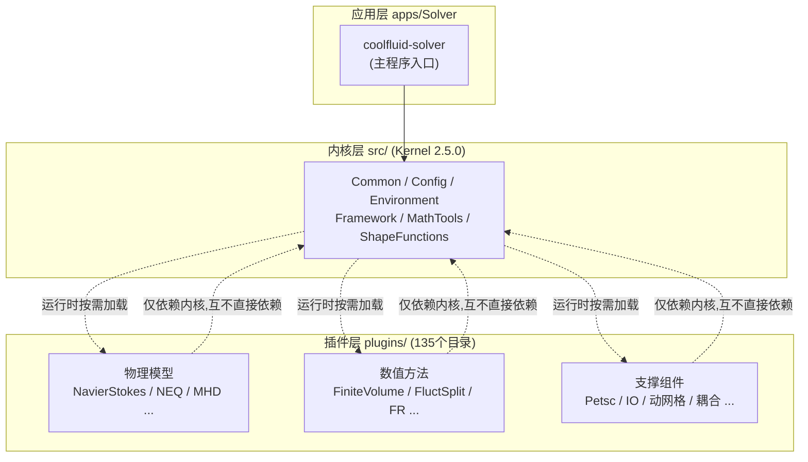
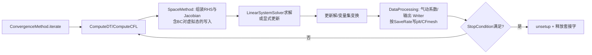
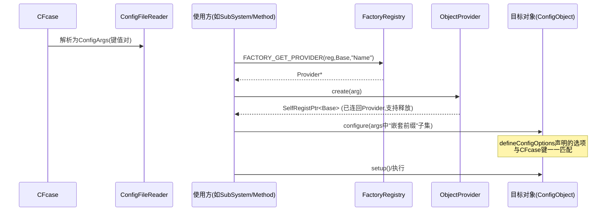

# 第 2 章 整体架构设计

本章自顶向下剖析 COOLFluiD 的体系结构：先看三层分层与插件装载机制（2.1），再逐模块拆解内核（2.2）与 `Framework` 的类职责地图（2.3），然后沿着"启动 → 配置 → 迭代"的数据流走一遍完整执行过程（2.4），最后覆盖并行框架（2.5）、目录与文件组织（2.6）以及插件注册/工厂机制原理（2.7）。开发者请重点精读 2.4、2.7 两节——它们是第 11 章二次开发的直接基础。

---

## 2.1 总体分层架构

### 2.1.1 三层结构



三个层次各司其职、依赖方向单一：

| 层次 | 位置 | 职责 | 典型内容 |
|------|------|------|----------|
| **应用层** | `apps/Solver/` | 主程序入口：解析命令行、驱动环境与仿真生命周期 | `coolfluid-solver.cxx`、默认配置 `coolfluid-solver.xml`、静态注册 `PluginsRegister.hh` |
| **内核层** | `src/`（约 1186 文件） | 框架机制：配置系统、工厂、网格数据结构、方法接口、并行通信。**不含任何具体物理/数值实现** | 见 2.2 节 |
| **插件层** | `plugins/`（约 9746 文件） | 全部具体实现：物理模型、空间/时间离散、线性求解、IO、动网格、耦合、后处理 | 分类总表见第 6.1 节 |

插件之间**不互相静态链接**，只依赖内核接口；因此"物理模型 × 数值方法"可以自由正交组合（例如 `NEQ` 物理同时被 `FiniteVolumeNEQ` 与 `FluctSplitNEQ` 两种方法使用）。编译期是否存在内部依赖可由 `CF_ENABLE_INTERNAL_DEPS` 控制（第 8.2.1 节）。

### 2.1.2 运行时动态装载机制（默认模式）

CFcase 中的模块声明是动态装载的唯一入口：

```
Simulator.Modules.Libs = libCFmeshFileWriter libCFmeshFileReader libTecplotWriter \
                         libNavierStokes libFiniteVolume libNewtonMethod libPetscI
```

装载链（源码依据：`src/Framework/Simulator.cxx`、`src/Environment/ModuleLoader.cxx`、`src/Common/PosixDlopenLibLoader.cxx`）：

1. `Simulator::configure()` 在完成路径配置（`SimulatorPaths` → `DirPaths`）之后，配置其内嵌的 `ModuleLoader`（对应 CFcase 前缀 `Simulator.Modules.*`）；
2. `ModuleLoader::loadExternalModules()` 以 `DirPaths` 中的模块目录（来自 `Simulator.Paths.ModulesDir`、命令行 `--ldir`、构建目录 `dso/`）作为库搜索路径；
3. 对声明列表中的每一项：剥离 `lib` 前缀得到模块名；若 `CFEnv` 的 `ModuleRegistry` 中尚未注册该模块（防重复装载），则调用 `LibLoader::load_library()` —— POSIX 平台由 `PosixDlopenLibLoader` 执行 `dlopen`；
4. `dlopen` 触发库内**全局静态对象**的构造——每个 provider（见 2.7.2 节）在构造时把自己注册进所属模块的 `SelfRegistry`，物理/方法/命令由此进入工厂；
5. 随后 `CFEnv::getInstance().initiateModules()` 完成已装载模块的环境初始化。

> **提示**：报错 `ModuleLoadFailedException` / `Could not load library` 时，按此链条排查：库是否编译（`<CF_BUILD>/dso/` 下有无对应 `.so`）→ 搜索路径是否包含（`--ldir`）→ 库名拼写是否与 `Simulator.Modules.Libs` 一致（含 `lib` 前缀）。

### 2.1.3 静态编译模式

CMake 选项 **`CF_ENABLE_SINGLEEXEC`**（注意拼写无下划线，对应编译宏 `CF_HAVE_SINGLE_EXEC`；配合 `CF_ENABLE_STATIC`/`CF_HAVE_ALLSTATIC`）将全部启用插件静态链接进单一可执行文件：

- 主程序经 `#include "PluginsRegister.hh"`（实测 3097 行，逐个包含启用插件的模块头并调用 `registerAll(fRegistry)`）一次性注册所有 provider；
- Linux 下静态链接使用 `-Wl,-whole-archive ... -Wl,-no-whole-archive` 保证静态初始化器不被裁剪（`cmake/DefineGlobalOptions.cmake` 实测）；
- 该模式下 CFcase 的 `Modules.Libs` 仍建议保留（作为配置自描述），但装载动作退化为查表。

两种模式的取舍见第 8.2.1 节；日常开发推荐动态模式（改插件无需重链主程序）。

---

## 2.2 内核模块详解（`src/` 逐子目录说明）

| 子目录 | 文件数 | 一句话职责 | 详见 |
|--------|--------|------------|------|
| `src/Common/` | 188 | 对象模型、智能指针、工厂注册表、MPI 封装、日志、字符串/文件系统工具 | 2.2.1 |
| `src/Config/` | 46 | 配置系统：选项定义、CFcase 解析、校验 | 2.2.2 |
| `src/Environment/` | 45 | 运行环境：生命周期、目录路径、模块装载/注册、环境级工厂 | 2.2.3 |
| `src/Framework/` | 567 | **内核核心**：仿真管理、网格、数据存储、方法接口与通用命令 | 2.3 节 |
| `src/MathTools/` | 66 | 小型矩阵/向量、数学函数与常量 | 2.2.5 |
| `src/ShapeFunctions/` | 202 | 各单元各阶形函数与积分点 | 2.2.6 |
| `src/logcpp/` | 65 | 内置（改版 log4cpp）日志实现 | 2.2.7 |
| `src/UnitTests/` | — | 内核单元测试 | 2.2.8 |

### 2.2.1 `src/Common/`：基础设施

- **对象模型**：对象基类族 `OwnedObject`（带引用计数基座）、`SetupObject`（可 setup/unsetup）、`NamedObject`（具名）、`TaggedObject`（带标签）；引用计数指针 `SharedPtr`、非拥有观察指针 `SafePtr`、携带释放职责的自注册指针 `SelfRegistPtr`（工厂产物即用它返回，`ObjectProvider::create()`）；
- **工厂**：`FactoryBase`（`Common/FactoryBase.hh`）与 `FactoryRegistry`（`Common/FactoryRegistry.hh`）。`FactoryRegistry` 是"基类名 → Factory → Provider 集"的二级容器，主程序创建唯一实例并下发到 Maestro/Simulator/SubSystem；完整的类型化 `Factory` 模板位于 `src/Environment/`（2.2.3 节）；
- **动态库**：`LibLoader` 抽象 + `PosixDlopenLibLoader` / `Win32LibLoader` 两实现；
- **并行**：`PE` 单例（`Common/PE.hh`）封装 MPI——进程组管理（如 "Default" 组）、rank 数查询、barrier、归约（第 2.5.1 节），配套接口 `PEInterface` 与 `PEFunctions`；
- **日志与诊断**：`CFLog/CFout/CFerr` 宏与 `CFLogger` 单例（`Common/CFLog.hh`，级别 VERBOSE…DEBUG，底层由 `logcpp/` 实现）、`Stopwatch`/`TimePolicies` 计时工具、`OSystem`（进程/系统信息）、`cf_assert/cf_always_assert` 断言宏、异常体系根 `Exception` 与 `FromHere()` 溯源；
- **工具**：`StringOps`（前后缀/分词/大小写）、`FileDownloader`、`FilesystemException` 等。

> **注**：`MathConsts`/`MathTools` 位于 `src/MathTools/` 而非 Common；Common 中不存在 `CFObject` 类（对象根为上述四基类族），也不存在 `AutoPtr`/`PEAPI`/`PEOperations`/`BasicFunctions`/`FilesystemUtils` 等类，引用网上旧资料时注意甄别。

### 2.2.2 `src/Config/`：配置系统

- `ConfigObject`：一切可配置类的基类。子类在构造时 `defineConfigOptions()` 声明选项并 `setParameter()` 绑定成员；`configure(args)` 按**嵌套命名**（如 `Simulator.SubSystem.NewtonIterator.Data.CFL.Value`）匹配并赋值；
- `Option` / `OptionList` / `OptionT<T>`：类型化选项容器，支持默认值、校验；数组/向量选项由 `OptionT` 的类型化实例承载（无独立的 `OptionArray` 类）；
- `ConfigFileReader`：把 `.CFcase` 解析为 `ConfigArgs`（键值对映射，保留出现顺序）；另有 `NestedConfigFileReader`、`XMLConfigFileReader`（供 `xcfcase_converter` 等工具）；
- 未使用参数处理：`doValidation/doComplete`，配合 `CFEnv` 的 `ErrorOnUnusedConfig` 可将拼写错误升级为致命错误（第 9.2.3 节）。

### 2.2.3 `src/Environment/`：运行环境

- `CFEnv` 单例：`initiate()`（MPI、日志、目录初始化）→ `configure()`（CFcase 顶层环境选项）→ `setup()` → `unsetup()/terminate()`；`initiateModules()` 服务于插件装载后阶段；
- `DirPaths` 单例：基目录（`--bdir`）、工作/结果目录（`Simulator.Paths.*`）、模块目录（`--ldir`）、文件仓库 URL；
- **模块体系**：`ModuleRegisterBase/ModuleRegister<MODULE>`（每个插件的模块单例）、`ModuleRegistry`（已装载模块表）、`ModuleLoader`（装载编排，见 2.1.2）、`ModuleLoadFailedException`；
- **Provider 体系**：`ObjectProvider<CONCRETE, BASE, MODULE, NBARGS>`（`Environment/ObjectProvider.hh`）、完整类型化 `Factory`/`FactoryRegistry`、`SingleBehaviorFactory`；
- 其他：输入/输出文件处理器（`FileHandlerInput`/`FileHandlerOutput`，含 `CurlAccessRepository` 远程取文件，`CF_ENABLE_CURL`）、日志级别控制。

### 2.2.4 `src/Framework/`：内核核心

见 2.3 节专述。

### 2.2.5 `src/MathTools/`

`Matrix`（固定小尺寸）、`RealMatrix/RealVector`（动态）、`MathConsts`（`CFrealMax()` 等）、`MathFunctions`（min/max/指数工具）、`MathChecks`、**`LeastSquaresSolver`**（注意是 `Squares` 复数，源码 `src/MathTools/LeastSquaresSolver.hh`；其 `.cxx` 为空文件）、插值工具与 `.inc` 常量表。物理插件的通量计算普遍以这些类型为工作马。

### 2.2.6 `src/ShapeFunctions/`

每类单元（`Line/Triag/Quad/Tetra/Hexa/Prism/Pyram`）× 每阶（P1、P2…）一对 `ShapeFunction` 类（形函数值与导数，如 `LagrangeTriagP2`）与对应高斯积分点类（`ContourGaussLegendre*Lagrange*` 族）；枚举 `CFGeoShape/CFPolyForm/CFPolyOrder/CFQuadrature/CFIntegration`（`Framework` 中定义）驱动选择。高阶方法（FR/SD/SV/DG）大量依赖。

### 2.2.7 `src/logcpp/` 与 2.2.8 `src/UnitTests/`

`logcpp/` 是随源码携带的日志库实现（启用 `CF_ENABLE_LOG4CPP` 时编译完整功能，否则使用内置精简实现；`Category`/`Priority` 概念来自这里）；`UnitTests/` 存放内核单元测试（`MathTools/` 下 `utest-*.cxx` 等，构建开关 `CF_ENABLE_UNITTESTS`，默认关，见第 8.2.1 节；插件侧无 `testsuite/` 目录，测试组织见第 11.8.2 节）。

---

## 2.3 `src/Framework` 内部架构（类职责地图）

`Framework` 是理解二次开发的关键。以下按六个功能域给出核心类地图（文件均位于 `src/Framework/`）。

### 2.3.1 仿真管理链

| 类 | 职责 |
|----|------|
| `Maestro` / `SimpleMaestro`（`SMaestro.cxx`，注册名 **SimpleMaestro**） | 仿真指挥者。主程序创建 Maestro、`manage(sim)` 并发送 `"control"` 信号；SimpleMaestro 依次触发子系统构建/配置/执行/销毁事件 |
| `Simulator`（`Simulator.cxx`） | 打开并解析 CFcase（`openCaseFile`）、装载插件模块（内嵌 `ModuleLoader`）、持有路径配置（内嵌 `SimulatorPaths`）；监听 `CF_ON_MAESTRO_BUILDSUBSYSTEM/CONFIGSUBSYSTEM/DESTROYSUBSYSTEM` 事件，按需经 Provider 实例化 `SubSystem`（默认类型 `StandardSubSystem`，另有 `CustomSubSystem`、`PrePostProcessingSubSystem` 等） |
| `SubSystem` / `SubSystemStatus`（+ `SubSystemStatusStack`） | 单个求解子系统的实体：配置命名空间（Namespace）与单例、分配全部 DataSocket、组织方法与命令组（`setCommands`/`CommandGroup`）、驱动迭代；`SubSystemStatus` 维护迭代计数、时间、CFL、残差等运行态 |
| `SimulationStatus` | 全局仿真状态（如最终残差，供 `--residual` 回归校验读取） |
| 停止条件命令族 | `MaxNumberStepsCondition`、`NormCondition`、`MaxTimeCondition`、`MaxNumberSubIterCondition` 等（对应 CFcase `StopCondition`） |
| `EventHandler`/`Signal` | Maestro 与 Simulator/SubSystem 之间的事件总线 |

> **说明**：`Simulator.SubSystems/SubSystemTypes/SubSystemRanks` 三个 CFcase 选项（`Simulator.cxx` 中定义）支持一个 CFcase 定义多个子系统并为其划分 MPI rank 区间（形如 `0:3;4:7`），这是流固耦合等应用在单进程组内分区共跑的基础。

### 2.3.2 物理模型抽象

| 类 | 职责 |
|----|------|
| `PhysicalModel`（`PhysicalModel.hh`） | 物理模型句柄：名字（CFcase `PhysicalModelType`，如 `NavierStokes2D`）、维度、方程数、子模型容器；经 Provider 由物理插件提供实现 |
| `PhysicalModelImpl` / `PhysicalProperty` | 具体实现载体与"标量物性"封装（如气体常数、参考量） |
| `VarSet` 及其派生 | **变量集**：一组变量间的换算（`Cons↔Puvt↔Roe…`）。CFcase 中 `UpdateVar/SolutionVar/LinearVar/DiffusiveVar` 即选择各环节使用的变量集 |
| `ConvectiveVarSet` / `DiffusiveVarSet` | 对流/粘性通量计算接口（`computeFlux`、特征速度、谱半径等） |
| 物理项描述族 | `ConvectionPM`、`DiffusionPM`、`ConvectionDiffusionPM`、`ConvectionReactionPM` 等：向方法声明"本物理含哪些项"，供 RDS/DG/FR 等通用方法据此装配 |
| `PhysicalChemicalLibrary` 等库接口 | 热力学/输运/化学反应/辐射等外部物性库的抽象（实现见 `Mutation*` 插件） |

### 2.3.3 网格与几何

| 类 | 职责 |
|----|------|
| `MeshData` / `MeshDataStack` | 网格数据总容器（节点、状态、单元、TRS、连通性）与栈式管理 |
| `MeshBuilder` / `MeshDataBuilder`（如 `FVMCC_MeshDataBuilder`） | 由 `MeshCreator` 读入的数据构建运行期网格对象 |
| `MeshCreator`（Provider，如 `CFmeshFileReader`） | 网格来源抽象：读文件/程序化生成/格式转换（`convertFrom = Xxx2CFmesh`） |
| `TopologicalRegionSet`（TRS）/ `TopologicalRegion` | 拓扑区域集：边界与内部面/单元集合。CFcase `listTRS` 声明名字，BC/初始化命令经 `applyTRS` 绑定 |
| `GeometricEntity` 及 `Cell/Face/Edge/State/Node` | 几何实体抽象：单元/面/边及其上的状态与节点；`CFGeoEnt`（维型枚举）、`CFGeoShape`（形状枚举）、`CFPolyOrder`（P0–P10，枚举 ORDER0–ORDER10） |
| GeoBuilder 族 | `CellTrsGeoBuilder`、`FaceTrsGeoBuilder`、`FaceCellTrsGeoBuilder` 等：把 TRS 转为遍历用的 GE 序列（迭代器工厂） |
| `FaceJacobiansDeterminant`、`ContourIntegrator` | 面雅可比/面积分（FVM 通量与后处理用；含 `GaussLegendreContourIntegratorImpl`、`NullContourIntegratorImpl`） |
| `FileReader/FileWriter` + `CFmeshFileReader/Writer` | 网格/解 IO 抽象与 CFmesh 实现（ASCII/二进制，模板见 `.ci`） |

### 2.3.4 数据存储与交换（DataSocket 体系）

| 类 | 职责 |
|----|------|
| `DataStorage` | 子系统内全部数据数组的宿主 |
| `DataSocket` | 一块具名数据的"套接字"：类型、大小、生命周期状态 |
| `DataSocketSource/Sink`（及 `BaseDataSocketSource/Sink`） | 命令/策略声明"我需要创建/读取哪些套接字"的接口；`DataSocketSink.hh` 等以模板支持任意数据类型 |
| `DataHandle<T>` | 对已分配套接字的随机访问句柄（含 MPI 变体 `DataHandleMPI`） |
| `DataBroker` | 汇总所有 Source/Sink 的申请，统一决定套接字分配与释放时机（`SubSystem::allocateAllSockets/checkAllSockets` 校验） |

> **设计要点**：插件间**从不直接持有彼此的数据指针**，一律通过命名套接字交换（如 FVM 的 `states`、`rhs`、`jacobians`）。这既解耦插件，也让内存生命周期全局可控。新增命令时必须正确声明 Source/Sink，见第 11.2.3 节。

### 2.3.5 数值方法抽象

| 类 | 职责 |
|----|------|
| `Method` / `NumericalCommand` / `NumericalStrategy` | 方法 = 命令 + 策略的容器；命令是"具名、可配置、可组合"的动作单元（BC、初始化、Setup 都是命令） |
| `SpaceMethod`（`SpaceMethod.hh`） | 空间离散接口：`setup/unsetup/computeSpatialDiscretization(rhs, jacobian)`。实现：`CellCenterFVM`（FVM）、`RDS`（FluctSplit）、`FRMethod`、`SpectralFDMethod`、`SpectralFVMethod`、DG 等 |
| `ConvergenceMethod` / `ConvergenceMethodData` | 时间推进接口（`iterate()`）：ForwardEuler/RungeKutta*/BackwardEuler/NewtonIterator/LUSGS |
| `LinearSystemSolver` / `EigenSolver` | 线性求解接口（solve/`getMatrix`…）与特征值问题接口；实现：PETSc、Pardiso、SAMGLSS、Trilinos、Paralution |
| `BlockAccumulator`（及 `Base/BlockAccumulatorBaseCUDA`） | 分块稀疏矩阵装配器（NS×NS 单元块） |
| 稀疏模式族 | `CellCenteredSparsity`、`CellVertexSparsity`、`CellVertexSparsityNoBlock`、`CellCenteredDiffLocalApproachSparsity` 等：隐式矩阵结构预生成 |
| Provider 机制 | `BaseMethodCommandProvider`/`BaseMethodStrategyProvider`/`MethodCommandProvider`：让 CFcase 字符串定位命令/策略类（原理见 2.7 节） |

### 2.3.6 通用命令与辅助组件

| 类别 | 代表类 |
|------|--------|
| FVM 公共基座 | `BaseSetupFVMCC`、`ComputeFaceNormals*P1`（六种单元）、`FVMCC_MeshDataBuilder` |
| 初始化 | `InitState`（自由格式表达式 `Vars/Def`）、`FileInitState`、插值初始化命令 |
| 边界条件基类 | 各方法自带的 BC 命令基座（如 FVMCC 的 `FVMCC_BC` 族），虚拟态由 `ComputeDummyStates` 维护 |
| CFL/DT 控制 | `ComputeCFL/ComputeDT` 接口 + `InteractiveComputeCFL`、`ExprComputeCFL`（表达式）、`NullComputeCFL`、`DetermineCFL`、`ConstantDTWarn` |
| 范数与收敛 | `ComputeNorm/ComputeL2Norm/ComputeAllNorms`、`AbsoluteNormAndMaxIter`、`NormAndMaxSubIter`、`RelativeNormAndMaxSubIter` |
| 数据处理 | `DataProcessing/DataProcessingMethod/DataProcessingData`：把后处理命令挂入迭代（如 `AeroCoef` 输出） |
| 过滤器 | `FilterRHS/EquationFilter/IdentityFilterRHS`、`MinMaxFilterState/MaxFilterState` 等：迭代中按条件过滤方程/状态 |
| 外推与插值 | `DistanceBasedExtrapolator`、`LookupInterpolator`、`StateInterpolator` |
| 耦合 | `CouplerData/CouplerMethod`、`CollaboratorAccess`、`NullCouplerMethod`（实现在 `SubSystemCoupler/ConcurrentCoupler` 插件） |
| 网格动平衡 | `DynamicBalancerMethod(Data)`（ParMetis 重新剖分挂钩） |
| 误差估计/自适应 | `ErrorEstimatorMethod/Data`、`MeshAdapterMethod`（实现在 `SimpleGlobalMeshAdapter` 等插件） |
| CUDA | `CudaDeviceManager.cu`（设备选择，接受 CFcase 配置）、`CudaTimer`、`BlockAccumulatorBaseCUDA` |
| 交互参数 | `InteractiveParamReader`（`.inter` 文件，CFcase 前缀 `SubSystem.InteractiveParamReader`） |

---

## 2.4 数据流与一次迭代的执行流程

### 2.4.1 启动流程

```mermaid
sequenceDiagram
    participant U as 用户/mpirun
    participant M as main() (coolfluid-solver.cxx)
    participant E as CFEnv
    participant Ma as Maestro(SimpleMaestro)
    participant S as Simulator
    participant SS as SubSystem

    U->>M: coolfluid-solver --scase case.CFcase
    M->>M: 解析命令行(AppOptions) / 读取 --conf
    M->>E: CFEnv::initiate() (MPI/日志/目录)
    M->>E: 解析CFcase并configure环境
    M->>Ma: FACTORY_GET_PROVIDER(Maestro,"SimpleMaestro")创建
    M->>S: new Simulator + openCaseFile()
    Note over S: configure(): 路径→ModuleLoader<br/>dlopen装载全部libXXX
    M->>Ma: maestro->manage(sim); call_signal("control")
    Ma->>S: 事件 CF_ON_MAESTRO_BUILDSUBSYSTEM
    S->>SS: Provider创建SubSystem(Standard)
    Ma->>S: 事件 CF_ON_MAESTRO_CONFIGSUBSYSTEM
    S->>SS: configure(CFcase其余键值)
    SS->>SS: 命名空间/单例/交互参数文件<br/>allocateSockets → 方法setup → 初始化/BC
    Ma->>SS: 驱动迭代直至StopCondition
    Ma->>S: CF_ON_MAESTRO_DESTROYSUBSYSTEM
    M->>E: 残差校验(--residual) → unsetup/terminate
```

### 2.4.2 SubSystem 内部流水线（单次迭代视角）

一个 `StandardSubSystem` 的生命周期可概括为两段：

**装配段（configure/setup，一次性）**

1. `configure()`：应用命名空间（Namespace）与单例配置，配置 `InteractiveParamReader`（`.inter` 文件）；
2. `allocateAllSockets()`：所有方法/命令声明的套接字统一分配；
3. 各方法的 setup 命令执行：`MeshCreator` 读网格 → `MeshDataBuilder` 构建 → `PhysicalModel` 就位 → `SpaceMethod` 的 `SetupCom`（如 `LeastSquareP1Setup` 建立梯度模板）；
4. 初始化命令（`InitComds`）与边界条件命令（`BcComds`）按 CFcase 声明实例化并配置。

**迭代段（每步）**



显式方法（RK 族）不经过 LSS；隐式方法（Newton/BackwardEuler/LUSGS）在 C 中同时组装 Jacobian 并在 D 中求解。收敛监测由 `ConvergenceFile`、`ShowRate/ConvRate` 控制（第 9.3.2 节）。

**流水线环节 ↔ 算法原理对照表**（本章讲"谁调用谁"，第 4 章讲"为什么这么算"，可交叉阅读）：

| 流水线环节 | 数学/算法内涵 | 原理详见 |
|------------|---------------|----------|
| B：`ComputeDT/ComputeCFL` | 当地时间步 $\Delta t_i=\mathrm{CFL}\cdot V_i/\sum_f\lambda_{max}A_f$ | 第 4.7.4 节 |
| C：`SpaceMethod` 组装 RHS | 空间离散：面通量求和 $R_i=\sum_f\hat{\mathbf F}A_f$ | 第 4.2 节（FVM）、4.9（RDS）、4.10（FR） |
| ├ 重构 + 限制器 | 由单元平均恢复界面左右态并抑制振荡 | 第 4.3 节 |
| ├ 界面数值通量 | 近似 Riemann 求解器（Roe/AUSM/HLL） | 第 4.4 节 |
| ├ 粘性通量 | 面控制体梯度 → $\tau_{ij}$、$\mathbf q$ | 第 4.5 节 |
| ├ 源项与轴对称 | 化学/辐射/几何源项 | 第 4.6 节 |
| └ BC 写虚拟态 | 边界条件的外推/反射/特征构造 | 第 3.6.5 节 |
| C（隐式侧）：组装 Jacobian | 分块稀疏装配 $J=\partial R/\partial U$（`BlockAccumulator`） | 第 4.8.2 节 |
| D：LSS 求解 | $(V/\Delta t+J)\Delta U=-\ldots$ 的 Krylov/直接求解 | 第 4.8 节 |
| E：更新解 | Newton/BDF2/CN 的更新公式与松弛 | 第 4.7.3、4.7.5 节 |
| 方法选型（显式/隐式/BDF2…） | 时间推进格式全表 | 第 4.7.6 节 |

### 2.4.3 实例走查：`doubleEllipseNS_PG.CFcase`

以 `plugins/NavierStokes/testcases/DoubleEllipse/doubleEllipseNS_PG.CFcase`（双椭球，M∞=25、Re≈1.7万、二阶 FVM + PETSc 隐式）为例，CFcase 各配置组与机制对应关系（括号内为 CFcase 中的实测原文）：

| CFcase 配置组（节选） | 触发的机制 |
|------------------------|------------|
| `Simulator.Modules.Libs = libCFmeshFileWriter … libNavierStokes libMutation libMutationI libFiniteVolume libNewtonMethod libFiniteVolumeNavierStokes libTHOR2CFmesh` | `ModuleLoader` 逐个 `dlopen`；各库内 `ObjectProvider` 静态注册（第 2.1.2 节） |
| `Simulator.Paths.WorkingDir / ResultsDir` | `SimulatorPaths` → `DirPaths`（相对路径以运行目录解析） |
| `Simulator.SubSystem.InteractiveParamReader.FileName = de.inter` | `SubSystem` 内嵌交互参数读取器，为后续命令提供 `.inter` 中的参数。⚠️ **注意**：仓库中 `plugins/NavierStokes/testcases/DoubleEllipse/` 下**并无 `de.inter` 文件**（`find plugins -name "de.inter"` 无结果，可能被忽略或未提交）；因此该键引用的文件缺失。运行此算例需自行按 `.inter` 语法提供该文件，或用 `--bdir` 指向含它的目录，否则交互参数读取会失败（`InteractiveParamReader` 机制见 9.3.10） |
| `Simulator.SubSystem.Default.PhysicalModelType = NavierStokes2D` + `NavierStokes2D.refValues/refLength/DiffTerm.Reynolds/ConvTerm.machInf/ConvTerm.tempRef` | `PhysicalModel` Provider 实例化 `NavierStokes2D`；有量纲参考体系建立（`Default` 为 SubSystem 默认命名空间） |
| `OutputFormat = Tecplot CFmesh` + 各 Writer 的 `FileName/SaveRate/AppendTime/AppendIter` + `Tecplot.Data.updateVar = Puvt` | `FileWriter` Provider（`TecplotWriter`、内置 CFmesh Writer）挂入输出循环；输出前变量集切换到 `Puvt`。⚠️ **注意**：本 CFcase 用的是 `Tecplot.Data.updateVar`，但 `TecplotWriter` 的配置键实为 **`outputVar`**（`TecWriterData.cxx:39`，`updateVar` 只在 `ParaViewWriter` 中注册，`ParaWriterData.cxx:40`）；因此这里的 `updateVar = Puvt` 在运行期是**未消费键**（默认仅告警，见 12.3.2），Tecplot 实际输出变量集取自 SpaceMethod 的 `UpdateVar`。欲显式指定 Tecplot 输出变量集，应写 **`Tecplot.Data.outputVar = Puvt`**（见第 10.1.4 节）。这是上游算例的写法，照抄会得到错误的变量集切换 |
| `StopCondition = MaxNumberSteps`（`Norm` 被注释） | 停止条件命令族按名字实例化 |
| `Simulator.SubSystem.Default.listTRS = InnerFaces NoSlipWall SuperInlet SuperOutlet` | 网格中四个 TRS 注册，供 BC/初始化绑定 |
| `MeshCreator = CFmeshFileReader` + `Data.FileName/Data.builderName = FVMCC` + `Data.polyTypeName = Lagrange` | `MeshCreator` Provider；`builderName = FVMCC` 选择 `FVMCC_MeshDataBuilder`；`convertFrom = THOR2CFmesh`（本算例注释）时先格式转换 |
| `LinearSystemSolver = PETSC` + `LSSNames = NewtonIteratorLSS` + `NewtonIteratorLSS.Data.PCType = PCASM / KSPType = KSPGMRES / MatOrderingType = MATORDERING_RCM` | LSS Provider（Petsc 插件）；**命名实例**模式：LSS 可配置多个，各用各的参数 |
| `ConvergenceMethod = NewtonIterator` + `Data.CFL.Value = 0.3`（`ComputeCFL = Function` 被注释）+ `AbsoluteNormAndMaxIter.MaxIter = 1` | `ConvergenceMethod` Provider（NewtonMethod 插件）；CFL 控制器默认 Interactive，可换用 `ComputeCFL = Function` 表达式求值 |
| `SpaceMethod = CellCenterFVM` + `ComputeRHS = NumJacob` + `ComputeTimeRHS = PseudoSteadyTimeRhs` | `SpaceMethod` Provider；数值 Jacobian 与伪时间残差策略实例化 |
| `Data.FluxSplitter = Centred / UpdateVar = Puvt / SolutionVar = Cons / LinearVar = Roe / DiffusiveVar = Puvt / DiffusiveFlux = NavierStokes / PolyRec = Constant` | 对流通量格式、各环节变量集、粘性通量、重构逐一由 Provider/VarSet 机制装配（`LinearLS2D` 与 `Venktn2D` 等二阶重构/限制器在注释中给出启用示例） |
| `InitComds/InitNames + InField.applyTRS/Vars/Def`、`BcComds/BcNames + Wall.applyTRS/TWall`… | 命令工厂按"类型列表 + 名字列表 + 各自参数"实例化初始化与 BC 命令并绑定 TRS（第 9.3.9 节） |

> **提示**：对照第 0 章场景 A 的 M15 圆柱算例重读本表，可覆盖更多特性（`RoeSA` 熵修正、`Venktn2D` 限制器、Tecplot 网格转换、restart）。

### 2.4.4 CFcase 字符串 ↔ C++ Provider 映射表（节选）

| CFcase 中的字符串 | 基类接口 | 实现位置 |
|--------------------|----------|----------|
| `SimpleMaestro`（默认） | `Maestro` | `src/Framework/SMaestro.cxx` |
| `StandardSubSystem`（默认）/ `CustomSubSystem` | `SubSystem` | `src/Framework/` |
| `CellCenterFVM` | `SpaceMethod` | `plugins/FiniteVolume/CellCenterFVM.cxx` |
| `NewtonIterator` | `ConvergenceMethod` | `plugins/NewtonMethod/` |
| `PETSC` | `LinearSystemSolver` | `plugins/Petsc/` |
| `CFmeshFileReader` | `MeshCreator` | `plugins/CFmeshFileReader/` |
| `Tecplot` | `FileWriter` | `plugins/TecplotWriter/` |
| `InitState`、`SuperInletFVMCC`、`NoSlipWallIsothermalNSPvtFVMCC`、`SuperOutletFVMCC` | `MethodCommand` | `plugins/FiniteVolume/` 及各物理插件（BC 注册名以各插件 Provider 实名为准，如 `NoSlipWallIsothermalNSPvtFVMCC` 注册于 `plugins/FiniteVolumeNavierStokes/NoSlipWallIsothermalNSPvt.cxx`） |
| `Puvt`、`Cons`、`Roe` 等 | `VarSet`（经 `VarSetTransformer`） | 各物理插件（如 `NavierStokes`） |
| `LeastSquareP1Setup` | `MethodCommand`（Setup） | `plugins/FiniteVolume/` |

规律：**凡在 CFcase 中以字符串出现的方法/命令/格式，必然对应某插件里一个 `ObjectProvider` 全局实例**（2.7.2 节）。反之，查某字符串的实现位置时，直接在 `plugins/` 全局搜索该字符串即可定位。

---

## 2.5 并行计算框架

### 2.5.1 MPI 并行

- **封装**：内核 `Common::PE` 单例统一管理 MPI 通信——进程组（如 `"Default"`）、rank 数、barrier、归约、广播；所有并行代码通过 `PE::GetPE()` 访问，不直接调 MPI API；
- **网格剖分**：CFmesh 支持预剖分格式；`ParMetisBalancer` 插件调用 ParMetis 完成划分，并经内核 `DynamicBalancerMethod` 挂钩支持运行期再平衡（负载变化大的动网格/自适应场景）；
- **通信数据**：Ghost（虚拟）单元/状态由 BC 命令与 `ComputeDummyStates` 维护；跨 rank 数据交换封装在 `DataHandleMPI` 与内核并行接口中，插件代码通常无需直接写 MPI；
- **子系统分区**：`Simulator.SubSystemRanks` 允许把不同子系统固定到不同 rank 区间（`0:3;4:7` 形式），服务耦合仿真；
- **运行**：`mpirun -np N coolfluid-solver --scase …`；并行算例的 CFcase 与剖分注意事项见第 9.5.2 节。

### 2.5.2 CUDA GPU 加速

- **启用**：CMake `CF_ENABLE_CUDA`（启用 CUDA 语言、追加 `.cu` 源扩展与 `CF_HAVE_CUDA` 宏）；`CF_CUDA_MALLOC` 控制显存分配方式（开启后定义 `CF_HAVE_CUDA_MALLOC`）；与 `CF_ENABLE_VIENNACL` 同开时定义 `CF_HAVE_VIENNACL`（GPU 线性代数路径）；
- **设备管理**：`Framework/CudaDeviceManager.cu` 单例管理设备选择与初始化，接受 CFcase 配置；`CudaTimer` 提供核函数计时；
- **GPU 化插件**：`FiniteVolumeCUDA`（FVMCC 的 RHS/Jacobian 核函数，`.cu`）与 `FluxReconstructionCUDA`（FR 算子）；`Paralution` 插件为迭代求解提供 GPU 后端；
- **实践建议**：GPU 路径覆盖的方法/物理组合有限（以 Euler/FVM 为主），生产前先核对插件文档（第 6 章）与算例（第 7 章）。

### 2.5.3 OpenMP

CMake 选项 `CF_ENABLE_OMP` 仅添加 `CF_HAVE_OMP` 编译定义；本代码库中 OpenMP 化程度很低，**横向扩展请依赖 MPI**。

### 2.5.4 并行运行模式与诊断

- `CF_ENABLE_PARALLEL_VERBOSE` / `CF_ENABLE_PARALLEL_DEBUG`：并行接口的冗余输出/调试代码（性能敏感时关闭）；
- 测试集成：`CF_TESTCASES_NCPUS` 指定 CTest 并行算例使用的 CPU 数（默认 2，第 8.2.1 节）；
- 运行期：rank 0 负责清理旧 `config*.log` 与 `*-output.log`（见 `coolfluid-solver.cxx`），各 rank 日志按级别输出，便于定位 rank 相关问题。

---

## 2.6 目录结构与文件组织

### 2.6.1 顶层目录

| 目录 | 内容 |
|------|------|
| `src/` | 内核（2.2 节） |
| `plugins/` | 全部插件（135 个目录，第 6 章） |
| `apps/` | 应用（当前仅 `Solver/`） |
| `cmake/` | 47 个文件：`DefineGlobalOptions`（用户开关）、`DefineBuildModes/Rules`（编译旗标）、13 个 `FindXxx`（Metis/ParMetis/PETSc/Trilinos/GSL/Curl/Mutationpp/GooglePerftools/Valgrind 等）、宏定义与 `CTest` 集成 |
| `config/` | 生成 `coolfluid_config.h` 等配置头的模板（`coolfluid_config.h.in` 等） |
| `doc/` | 手册 PDF/TeX、Doxygen 配置、许可证、本手册 |
| `tools/` | `conf`、`dev`、`MeshGeneration`、`scripts`（含 `init_testcases.sh`、`install-coolfluid-deps.pl`）、`style`、`svn`、`tecplot`、`templates`、`win32` |
| `packages/`、`pics/`、`videos/` | 打包依赖（内置 `mpich-3.1.3.tar.gz`、`parmetis-4.0.3.tar.gz` 源码包）、图示、演示视频 |
| 根目录 | `CMakeLists.txt`（总入口与依赖探测）、`prepare.pl`（构建配置脚本）、`build.sh`、`CTestConfig.cmake`、`INSTALL_NOTES.md`、`LICENSE`、`coolfluid.conf`（本机构建配置） |

### 2.6.2 单个插件的标准布局

```
plugins/MyPlugin/
├── CMakeLists.txt            # 必需：文件清单 + 依赖库 + CF_ADD_PLUGIN_LIBRARY / CF_ADD_PLUGIN_APP
├── MyPlugin.hh               # 模块注册类 ModuleRegister（2.7.1 节）
├── Xxx.hh / Xxx.cxx          # 实现源码（平铺，无子目录强制）
├── Xxx.ci                    # 可选：显式模板实例化（减编译时间，受 CF_ENABLE_EXPLICIT_TEMPLATES 控制）
├── FindXxx.cmake             # 可选：插件级外部依赖查找（仅依赖外部库的插件有，如 Petsc/FindPetsc.cmake、Pardiso/FindPardiso.cmake、Trilinos/FindTrilinos.cmake、SAMGLSS/FindSAMG.cmake 等，实测 11 个）
├── testcases/                # 可选：CFcase + CFmesh + 参考数据（CTest 集成）
└── ...
```

构建系统对插件是**自动发现**的（`plugins/CMakeLists.txt` 实测）：`FILE ( GLOB PLUGIN_MODULES "*/CMakeLists.txt" )` 逐一 `ADD_SUBDIRECTORY`，同时 `FILE ( GLOB_RECURSE PLUGIN_CMAKE_CFGS "*/*.cmake" )` 并 `INCLUDE`（这就是第三方插件放进 `plugins/` 即可被编译的原因；源码树外插件用 `CF_EXTRA_SEARCH_DIRS`，见第 8.2.1 节）。

> **注**：插件目录中**不存在** `coolfluid-<Name>.cmake` 形式的配置文件（依赖查找走上述 `FindXxx.cmake`），也**不存在** `testsuite/` 子目录（单元测试集中在 `src/UnitTests/`），引用旧文档时注意。

### 2.6.3 命名约定速查

| 模式 | 含义 | 示例 |
|------|------|------|
| `lib` + 插件名 | 动态库文件名（CFcase 中引用） | `libFiniteVolumeNavierStokes` |
| `FVMCC` / `RDS` / `FR` / `SD` / `SV` | 方法族后缀（单元中心 FVM / 残差分布 / 通量重构 / 谱差分 / 谱体积） | `SuperInletFVMCC` |
| `Cons / Puvt / Rhoivt / RhoivtTv / Pivt / Symm / Roe / RoeVinokur` | 变量集后缀 | `Euler2DNEQRhoivtTv` |
| `2D / 3D` / `1D` | 维度后缀 | `MHD3DProjectionCons` |
| `CNEQ / TCNEQ` | 化学 / 热化学非平衡后缀 | `NavierStokes2DTCNEQ` |
| `InRef / In…` | "在参考系/参考变量中"变体 | `MHD2DConsToPrimInRef` |
| `Null*` | 空实现（占位/默认关闭） | `NullLinearSystemSolver` |

### 2.6.4 构建产物布局

- **强制 out-of-source**：源码/构建目录同径时 CMake 直接报错退出（顶层 `CMakeLists.txt` 实测 `FATAL_ERROR`）；
- 构建目录内：`dso/`（全部插件动态库，`COOLFluiD_DSO_DIR`）、`apps/Solver/coolfluid-solver`（+ 拷贝的 `coolfluid-solver.xml` 与 wrapper 脚本）、生成的 `coolfluid_config.h`、`coolfluid_svnversion.hh`（构建根）；
- `make install` 安装树：`bin/`、`lib/`、`include/coolfluid/`、`data/`；安装库带 RPATH 指向 `CMAKE_INSTALL_PREFIX/lib`（`CMakeLists.txt` 实测 `CMAKE_INSTALL_RPATH = ${CMAKE_INSTALL_PREFIX}/lib`）；
- 个人构建定制：在构建目录放置 `coolfluid.cmake` 会被自动 `INCLUDE`（`INCLUDE(${COOLFluiD_BINARY_DIR}/coolfluid.cmake OPTIONAL)`），避免改动受版本管理的文件。

---

## 2.7 插件注册与工厂机制原理

本节是 2.1.2 节的机制深化，也是第 11 章所有开发任务的公共前置知识。

### 2.7.1 模块注册类（每个插件一份）

每个插件提供一个模块头（如 `plugins/FiniteVolume/FiniteVolume.hh`，实测原文）：

```cpp
class FiniteVolumeModule : public Environment::ModuleRegister<FiniteVolumeModule> {
public:

  /// Static function that returns the module name.
  /// Must be implemented for the ModuleRegister template
  static std::string getModuleName()
  {
    return "FiniteVolume";
  }
  ...
};
```

`ModuleRegister<MODULE>` 是单例模板：同名模块在进程内只注册一次（配合 2.1.2 节的装载去重）。CFcase 中的库名（`libFiniteVolume`）与 `getModuleName()` 剥去前缀后一致。

### 2.7.2 三类 Provider 与注册模式

一切可从 CFcase 字符串实例化的类，都通过一个**全局静态 `ObjectProvider`** 注册（静态初始化器随 `dlopen` 执行，注册目标是所属模块的 `SelfRegistry`；`CF_HAVE_SINGLE_EXEC` 下改为主程序统一注册）。以 `CellCenterFVM` 为例（`plugins/FiniteVolume/CellCenterFVM.cxx`）：

```cpp
Environment::ObjectProvider<CellCenterFVM,     // 具体类
                            SpaceMethod,        // 基类（定义 PROVIDER/ARG1 等类型）
                            FiniteVolumeModule, // 所属模块
                            1>                  // create() 的构造参数个数（0/1/2 特化）
cellCenterFVMMethodProvider("CellCenterFVM");   // ← CFcase 中使用的字符串
```

按基类不同，实践中形成三类惯用 Provider：

| 类型 | 基类 | CFcase 出现位置 | 例子 |
|------|------|------------------|------|
| **方法 Provider** | `SpaceMethod`、`ConvergenceMethod`、`LinearSystemSolver`、`MeshCreator`、`FileWriter`、`Maestro`… | 各 `* = <名字>` 配置项 | `CellCenterFVM`、`NewtonIterator`、`PETSC` |
| **命令 Provider** | `MethodCommand`（经 `MethodCommandProvider`） | `InitComds/BcComds/SetupCom` 等"类型列表" | `InitState`、`SuperInletFVMCC`、`LeastSquareP1Setup` |
| **策略/组件 Provider** | `VarSet` 变换器、FluxSplitter、Limiter、PolyRec、ComputeRHS 策略等 | 方法内部 `Data.*` 配置项 | `Roe`、`Venktn2D`、`LinearLS2D`、`NumJacob` |

命令类还有一层**命名实例**机制：同一命令类可实例化多次、各自配置（CFcase 中"类型列表 + 名字列表 + `<名字>.<参数>`"三段式，如 `BcComds/BcNames/Wall.TWall`，见 2.4.3 节与第 9.3.9 节）。

### 2.7.3 从 CFcase 字符串到可运行对象的完整时序



要点：

1. `create()` 返回 `SelfRegistPtr<Base>`——对象携带其 Provider，销毁时经 `freeInstance()` 归还正确类型（跨插件边界的类型安全释放）；
2. `configure()` 的键匹配依赖**嵌套名**（如 `Simulator.SubSystem.CellCenterFVM.Wall.TWall` 中 `Wall` 是命令实例名、`TWall` 是其选项）；未匹配键进入"未使用参数"报告或报错（`ErrorOnUnusedConfig`）；
3. 方法/命令的执行顺序由 CFcase 中列表出现顺序与内核流水线（2.4.2 节）共同决定。

---

## 2.8 本章核对清单

- [ ] 能画出三层架构并说出"插件只依赖内核接口"这一约束的价值；
- [ ] 能跟踪 `Simulator.Modules.Libs` 从 dlopen 到 ObjectProvider 静态注册的完整链条（2.1.2、2.7 节）；
- [ ] 说出 `Common/Config/Environment/Framework` 四大模块各自解决的问题（含 2.2.1 中 Common 对象模型四基类与 `FactoryBase`/`FactoryRegistry` 的位置）；
- [ ] 理解 DataSocket 体系"命名套接字 + Broker 统一分配"的设计及对插件开发的意义；
- [ ] 以任一 CFcase 为例，说清 `SpaceMethod/ConvergenceMethod/LinearSystemSolver/MeshCreator` 四大 Provider 各自装配了什么；
- [ ] 知道 MPI 扩展走 `PE` + ParMetis 剖分，OpenMP 不可依赖；
- [ ] 能解释 `ObjectProvider<CONCRETE, BASE, MODULE, NBARGS>` 四个模板参数与三类惯用 Provider 的区别；
- [ ] 知道插件标准布局（`CF_ADD_PLUGIN_LIBRARY`、`FindXxx.cmake`、无 `testsuite/`）与 `CF_ENABLE_SINGLEEXEC` 静态模式的拼写。

---
*下一章：第 3 章 数学与物理模型——盘点内核接口之上的"物理积木"。*
