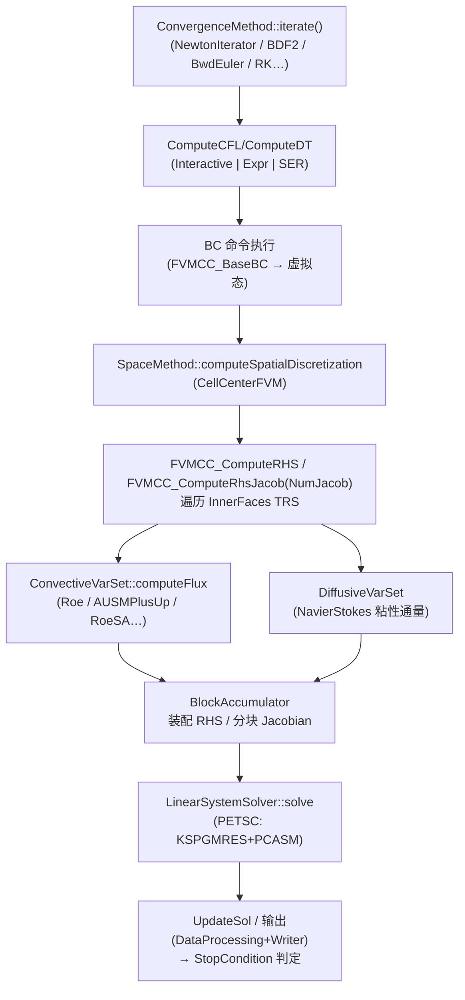

# 第 5 章 源代码文件逐文件说明

本章是全书篇幅最大的一章，给出**文件级地图**：内核 `src/` 的每个源文件（按基名归并 `.hh/.cxx` 对，`.ci` 显式模板实例化文件随其宿主说明）与插件层的分主题精讲及全索引。写作约定：

- **表格列**：`基名`（去掉 `.hh/.cxx` 后缀的文件名）｜`功能`（一句话）；
- **"逐文件"的粒度**：`Xxx.hh` + `Xxx.cxx` 合并为一行；`.ci`（显式模板实例化）与 `.cu`（CUDA 源）单独注明；
- **深入阅读的分层**：关键文件给出"关键类/调用关系"细节并指向其他章节；普通文件保持一句话粒度；
- **查证方法**：任何文件的语义均可用 `grep -rn "基名" plugins/ src/` 与 Doxygen（第 0.4 节）复核。

代码量基线（本仓库快照，全部经 `find` 实测）：内核 6 域共 **1054 个源文件（.hh/.cxx）**、对应 **654 个基名**——`Common` 175 文件/128 基名、`Config` 45/28、`Environment` 40/26、`Framework` 542/323、`MathTools` 51/42、`ShapeFunctions` 201/107（如含 `.ci`/`.inc` 等其余文件则分别是 188/46/45/567/66/202，见大纲 2.2 节）；插件层 **6231 个源文件（.hh+.cxx）**、**135 个插件目录**（计数见 5.8.16 节索引表）。

> ⚠️ **计数口径说明**：本节的"文件"一律指 **`.hh` + `.cxx`**（不含 `.ci` 显式模板文件、`.CFcase`/`.CFmesh`/数据文件等）；"基名"指去掉 `.hh/.cxx` 后缀后的**去重文件名**。旧版曾把 `Common` 基名写成 93、`Config` 写成 27、`MathTools` 写成 36、`Framework` 写成 543 文件，与实测不符，已全部更正。

**与第 3、4 章的分工（阅读建议）**：

| 章 | 回答的问题 | 视角 |
|----|------------|------|
| 第 3 章 | 这个**方程**是什么、每项什么含义、代码里对应哪个函数？ | 以**数学公式**为主线，附源码对照 |
| 第 4 章 | 这个**算法**如何从方程离散而来、伪代码与源码逐段如何对应？ | 以**算法步骤**为主线，附数学推导 |
| **本章（第 5 章）** | 这个**文件/目录**做什么、谁调用它、属于哪个模块？ | 以**文件**为主线的静态地图 |

因此：

- 想知道"`Euler2DVarSet::computeFlux` 为什么这么写"→ 查第 3.2.1 节（Euler 方程源码对照）；
- 想知道"`FVMCC_ComputeRHS::execute` 的循环在干什么"→ 查第 4.2.3 节（FVM 离散源码逐段对照）；
- 想知道"`RoeFlux.cxx` 在这个目录里的位置与邻居类"→ 查本章 5.7 节（插件层文件索引）。

---

## 5.1 `src/Common/`：基础设施（175 文件 / 128 基名）

依赖最少的底层模块，被所有其他模块（含插件）包含。

### 5.1.1 对象模型与内存

| 基名 | 功能 |
|------|------|
| `Common.hh`（基名 `Common`/`COOLFluiD`） | 命名空间入口与基础类型 `CFuint/CFint/CFreal` 等 |
| `NamedObject` | 带名字对象基类（ConfigObject 之上） |
| `TaggedObject` | 带运行期类型标签的对象基类 |
| `NonCopyable` / `NonInstantiable` | 禁拷贝 / 禁实例化基类 |
| `SharedPtr` | 引用计数智能指针（内核主力指针） |
| `SafePtr` | 非拥有观察指针（不增引用计数） |
| `SelfRegistPtr` | 自注册指针：对象携带其 Provider，`freeInstance` 跨库安全释放（工厂产物） |
| `OwnedObject` / `SetupObject` / `NullableObject` / `DynamicObject` / `Obj_Helper` | 所有权与生命周期语义（Setup 阶段回调）辅助 |
| `SafePtr`、`SharedPtr` 相关 | `PtrAlloc`、`Quartet`、`Trio`、`SwapEmpty`（工具模板） |
| `MemoryAllocator` / `MemoryAllocatorNormal` / `MemoryAllocatorMMap` / `BigAllocator` / `ArrayAllocator` / `GrowArray` | 内存分配策略族（`GrowArray` 为 GPU/大数据优化的分片数组，受 `CF_ENABLE_GROWARRAY` 控制） |
| `Array2D` | 二维数组容器 |
| `ConnectivityTable` | 连通性表（网格节点/单元关系的基础容器） |
| `CFMap` / `CFMap2D` / `CFMap3D` / `CFMultiMap` / `FastMap` | 映射容器族 |
| `Table` / `LookupTable2D` / `OldLookupTable` / `OldLookupTable2D` | 表格与二维查表（物性插值用） |
| `Storage` / `GeneralStorage` / `Group` | 单例存储框架（`MeshDataStack` 等基于此） |
| `IndexList` | 索引列表容器 |

### 5.1.2 工厂与注册

| 基名 | 功能 |
|------|------|
| `FactoryBase` | 工厂抽象基类 |
| `FactoryRegistry` | "基类 → Factory → Provider"二级注册表（第 2.7 节机制核心，单例由主程序创建下发） |
| `ProviderBase` | 所有 Provider 的公共基类 |
| `WorkerStatus` | Provider/工厂工作状态枚举 |

### 5.1.3 并行与系统

| 基名 | 功能 |
|------|------|
| `PE` / `PEInterface` / `PEFunctions` / `PM` | MPI 封装单例与接口（进程组 "Default"、rank、barrier、归约；`PM` 为进程管理辅助） |
| `LibLoader` | 动态库加载抽象 |
| `PosixDlopenLibLoader` / `Win32LibLoader` | Linux/Windows 实现（`dlopen`/`LoadLibrary`） |
| `OSystem` | 操作系统/进程环境单例（持有 `ProcessInfo`、`LibLoader`、信号处理器） |
| `ProcessInfo` + `ProcessInfoLinux/MacOSX/Win32` | 进程信息（PID、主机名等）的平台实现族 |
| `SignalHandler` + `SignalHandlerLinux/MacOSX/MacOSXarm/Win32` | 信号处理（段错误栈回溯）平台实现族 |
| `GlobalReduce`（另见 Framework 同名） | 全局归约接口（本目录内为 MPI/串行实现的公共声明） |

### 5.1.4 日志、诊断与异常

| 基名 | 功能 |
|------|------|
| `CFLog` | 日志宏与输出流（`CFLog(LEVEL,…)`、`CFout`），级别 VERBOSE…DEBUG |
| `Stopwatch` / `HourMinSec` / `TimePolicies` | 计时工具 |
| `Exception` | 异常根类（携带 `CodeLocation` 溯源） |
| `CodeLocation` | `FromHere()` 宏产生的源码位置对象 |
| 异常族 | `BadValueException`、`FailedAssertionException`、`FailedCastException`、`FileFormatException`、`FilesystemException`、`FloatingPointException`、`NoSuchStorageException`、`NoSuchValueException`、`NotImplementedException`、`NullPointerException`、`ParallelException`、`ParserException`、`SetupException`、`ShouldNotBeHereException`、`URLException` |
| `CFAssert` / `DebugFunctions` / `DemangledTypeID` / `CppTypeInfo` | 断言宏与调试辅助（类型名反修饰等） |
| `SignalHandler` 族 | 见 5.1.3 |

### 5.1.5 函数、事件与工具

| 基名 | 功能 |
|------|------|
| `DynamicFunctionCaller` / `MemFunArg` | 成员函数-参数绑定工具（Maestro 信号分发的底层） |
| `EventHandler` | 事件总线（`CF_ON_MAESTRO_*` 事件的注册与触发，第 2.4.1 节） |
| `EnumT` / `IsFundamental` / `Compatibility` / `StlHeaders` / `IOHelpers` / `CFPrintContainer` | 类型与 IO 模板工具 |
| `StringOps` | 字符串工具（前后缀/分词/大小写/数值转换） |
| `Fortran` | Fortran 名称修饰工具（混合编程） |
| `xmlParser` | 轻量 XML 解析（`coolfluid-solver.xml`、输出用） |
| `FileDownloader` / `CurlDownloader` | 文件下载抽象与 curl 实现（`CF_ENABLE_CURL`） |
| `ExportAPI` / `CommonAPI` | 符号导出宏（动态库可见性） |

> **使用提示**：插件代码与本目录的关系是"包含即用"——`CFLog/cf_assert/SharedPtr/StringOps/PE` 出现在几乎每个插件文件里；修改本目录需全量重编。

---

## 5.2 `src/Config/`：配置系统（45 文件 / 28 基名）

| 基名 | 功能 |
|------|------|
| `ConfigObject` | 一切可配置对象基类：`defineConfigOptions()` 声明选项、`configure(args)` 按嵌套名赋值、`getConfigOptions()` |
| `Option` / `OptionT` / `OptionList` / `OptionMarkers` / `ConfigOptionPtr` | 类型化选项与选项容器（`addConfigOption<T>("名", 默认值)`） |
| `ConfigArgs` | CFcase 键值对容器（有序映射，支持 `pass_filter` 过滤） |
| `ConfigFileReader` | `.CFcase` 文本解析器（`#` 注释、`\` 续行、`Key = Value`） |
| `XMLConfigFileReader` | XML 配置解析（`coolfluid-solver.xml`） |
| `NestedConfigFileReader` | 嵌套配置文件解析 |
| `Config` / `ConfigFacility` / `Registry`、`ConfigRegisterBase`（另见 Environment） | 配置模块入口与设施 |
| `BuilderParser` + `BuilderParserRules/FrameInfo/MandType/Exception` | "Builder"语法解析器（`Builder = Xxx`、`Builder.PolynomialOrder` 这类嵌套实例规则的实现） |
| `OptionValidation` / `OptionValidationException` / `PositiveLessThanOne` / `BiggerThanZero` / `BadMatchException` / `DuplicateNameException` / `NoEnvVarException` / `ConfigOptionException` | 选项校验器与校验异常族（数值范围、重复名、未用参数报错） |
| `ConverterTools` / `ManagerWorkerFrameType` / `ManagerWorkerProtocol` | 类型转换与主-从协议辅助 |

> **使用提示**：CFcase 中"未识别键"的报错/警告行为即由本目录实现（`ErrorOnUnusedConfig`，第 9.2.3 节）；插件作者最常打交道的两个类是 `ConfigObject` 与 `OptionList`（教程见第 11.2.2 节）。

---

## 5.3 `src/Environment/`：运行环境与模块体系（40 文件 / 26 基名）

| 基名 | 功能 |
|------|------|
| `CFEnv` | 运行环境单例：`initiate/configure/setup/unsetup/terminate` 全生命周期；`initiateModules()` 完成插件装载后初始化；持有事件处理器与 `CFEnvVars` |
| `CFEnvVars` | 环境级选项表（`ErrorOnUnusedConfig`、`ExceptionLogLevel` 等，CFcase 顶层 `CFEnv.*` 键） |
| `DirPaths` | 路径单例：基目录/工作目录/结果目录/模块目录/仓库 URL（`--bdir/--ldir` 与 `Simulator.Paths.*` 的落点） |
| `ModuleLoader` | 模块装载编排器（解析 `Simulator.Modules.Libs`、去重、调用 LibLoader，第 2.1.2 节） |
| `ModuleRegisterBase` / `ModuleRegister<MODULE>` | 插件模块单例模板（每个插件的 `XxxModule` 继承它） |
| `ModuleRegistry` / `ModuleLoadFailedException` | 已装载模块表与装载失败异常 |
| `ObjectProvider` | 模板 Provider（`<CONCRETE, BASE, MODULE, NBARGS>`，第 2.7.2 节详解） |
| `Provider` / `ConcreteProvider` / `SingleBehaviorFactory` | Provider 基类与单行为工厂 |
| `Factory` / `Registry` / `SelfRegistry` / **`ConfigRegistry`** / `ConfigRegisterBase` | 环境级工厂/注册表族（模块级 Provider 注册与全局 `FactoryRegistry` 的桥梁）。注：`ConfigRegistry` 位于 **`src/Environment/`**（`ConfigRegistry.hh/.cxx`），不在 `src/Config/` |
| `FileHandlerInput` / `FileHandlerInputConcrete` / `FileHandlerOutput` / `FileHandlerOutputConcrete` | 抽象文件 IO 与本地实现（本地/HTTP 仓库文件透明读取） |
| `CurlAccessRepository` / `DirectFileAccess` / `DirectFileWrite` | 远程仓库访问（curl）与直接文件访问 |
| `Environment` / `EnvironmentAPI` | 模块 API 汇出头与导出宏 |

> **使用提示**：`Could not load library` 类问题的三个关键词——`ModuleLoader`（名单）、`DirPaths`（搜索路径）、`ModuleRegistry`（去重表）——排查顺序见第 0.3.7 节。

---

## 5.4 `src/Framework/`：内核核心（542 文件 / 323 基名）

按功能域分组给出全部基名。域间关系：管理链（A）驱动方法框架（E），方法框架使用网格（B）与数据存储（C）描述物理模型（D），命令/控制组件（F–I）横向服务于所有方法。

### A. 仿真管理、子系统与命令框架

| 基名 | 功能 |
|------|------|
| `Simulator` | 仿真主体：打开/解析 CFcase、内嵌 `ModuleLoader` 与 `SimulatorPaths`、监听 Maestro 事件构建/配置/销毁子系统（第 2.4.1 节） |
| `Maestro` / `SMaestro` / `LMaestro` | 指挥者接口与实现（`SMaestro` 注册名 `SimpleMaestro` 为默认；`LMaestro` 服务于耦合场景的循环控制） |
| `SubSystem` | 子系统基类：命名空间/单例配置、套接字统一分配、命令组织 |
| `StandardSubSystem` | 默认子系统实现（完整求解流程） |
| `CustomSubSystem` / `SubIterCustomSubSystem` | 用户可定制的子系统变体（含子迭代控制） |
| `OnlyMeshSubSystem` | 仅建网格不求解的子系统（格式转换/前处理用） |
| `PrePostProcessingSubSystem` | 前/后处理专用子系统 |
| `SubSystemStatus` | 子系统运行态栈（迭代号、时间、CFL、残差等） |
| `SimulationStatus` | 全局状态（`--residual` 回归校验读取最终残差） |
| `Namespace` / `NamespaceGroup` / `NamespaceMember` / `NamespaceStack` / `NamespaceSwitcher` | 命名空间体系：多物理模型/多子系统并存的配置隔离（`PhysicalModelType` 挂在其下） |
| `Method` | 方法基类（命令 + 策略的容器与生命周期） |
| `MethodData` | 方法数据基类（如 `CellCenterFVMData` 继承之） |
| `MethodRegistry` | 方法注册辅助 |
| `MethodCommand` / `NumericalCommand` | 命令基类（可配置、可组合的最小执行单元） |
| `MethodCommandProvider` / `BaseMethodCommandProvider` | 命令 Provider（CFcase 字符串 → 命令实例，支持命名多实例） |
| `MethodStrategy` / `NumericalStrategy` / `MethodStrategyProvider` / `BaseMethodStrategyProvider` | 策略基类与 Provider（FluxSplitter/PolyRec/Limiter 等皆为策略） |
| `OptionMethodStrategy` | 方法-选项-策略关联辅助 |
| `CommandGroup` / `CommandsToTRSMapper` | 命令组与"命令组 ↔ TRS"映射（BC 应用范围的实现） |
| `NullCommand` | 空命令占位 |
| `StopCondition` / `StopConditionController` / `StopConditionControllerLocal` / `StopConditionControllerMPI` | 停止条件抽象与串行/并行控制器 |
| `MaxNumberStepsCondition` / `MaxNumberSubIterCondition` / `MaxTimeCondition` / `MaxTimeNumberStepsCondition` / `NormCondition` | 具体停止条件（对应 CFcase `StopCondition` 取值族） |
| `GlobalStopCriteria` / `GlobalMaxNumberStepsCriteria` | 全局停止判据（跨子系统/并行归约） |
| `InteractiveParamReader` | `.inter` 交互参数文件读取器（`Simulator.SubSystem.InteractiveParamReader.FileName`） |
| `EquationSubSysDescriptor` | 方程-子系统描述（耦合时标明各子系统方程归属） |
| `Framework` | 模块 API 汇出头 |

### B. 网格、几何与积分

| 基名 | 功能 |
|------|------|
| `MeshData` / `MeshDataStack`（经 Storage 单例） | 网格数据总容器：节点/状态/单元/TRS/连通性 |
| `MeshDataBuilder` | 由读取数据构建运行期网格的构建器基类 |
| `MeshCreator` / `MeshCreatorBase` / `MeshCreatorData` | 网格来源 Provider（CFcase `MeshCreator`，如 `CFmeshFileReader`） |
| `MeshFormatConverter` | 网格格式转换钩子（`convertFrom = Xxx2CFmesh`） |
| `MeshAdapterMethod` / `MeshAdapterData` | 网格自适应方法接口（实现在 `SimpleGlobalMeshAdapter` 等） |
| `MeshPartitioner` / `PartitionerData` / `PartitionerPeriodicTools` / `Metis` / `ParMetis` | 网格剖分框架与 Metis/ParMetis 实现（含周期面剖分一致性） |
| `MeshStatistics` | 网格统计输出 |
| `MeshDataInputSource` / `MeshDataSourceInterface` | 网格数据源抽象（Reader 的公共接口） |
| `TopologicalRegion` / `TopologicalRegionSet`（TRS） | 拓扑区域与区域集（边界/内部面集合，CFcase `listTRS`） |
| `TRSInfo` / `TRGeoConn` / `TrsNotFoundException` | TRS 元信息、几何连通与未找到异常 |
| `TRSDistributeData` | TRS 数据并行分发 |
| `MapGeoEnt` / `MapGeoEntToFormat` / `MapGeoToTrsAndIdx` | 几何实体-TRS-索引映射表 |
| `CellTrsGeoBuilder` / `FaceTrsGeoBuilder` / `FaceCellTrsGeoBuilder` / `StdTrsGeoBuilder` / `StdTrsMultiGeoBuilder` / `TrsGeoWithNodesBuilder` / `TrsMultiGeoWithNodesBuilder` / `CellConn` / `FaceToCellGEBuilder` | GeoBuilder 族：把 TRS 转为可遍历的 GE 序列（节点中心/面中心/多几何变体） |
| `GeometricEntity` / `GeometricEntityPool` / `GeometricEntityProvider` / `GeometricEntityRegister` / `BaseGeometricEntityProvider` | GE 抽象、对象池（避免遍历中频繁构造）与 Provider |
| `Cell` / `Face` / `Edge` / `Node` / `State` | 具体几何实体（状态=自由度所在点） |
| `IntegrableEntity` | 可积分实体接口 |
| `CFGeoEnt` / `CFGeoShape` / `CFPolyForm` / `CFPolyOrder` / `CFQuadrature` / `CFIntegration` / `CFDofType` / `CFSide` | 几何/多项式/积分枚举（形状、P0–P10（ORDER0–ORDER10）、Gauss 类型、自由度类型、侧面） |
| `Integrator` / `IntegratorImplProvider` / `IntegratorPattern` / `IntegratorProperties` / `IntegratorRegister` / `IntegratorTypes` | 积分器框架 |
| `ContourIntegrator` / `ContourIntegratorImpl` | 面/等值线积分（气动系数、后处理用） |
| `VolumeIntegrator` / `VolumeIntegratorImpl` | 体积分 |
| `VolumeCalculator` | 体积/面积计算命令 |
| `ElementTypeData` / `ElementDataArray` | 单元类型元数据与按单元存储的数据数组 |
| `FaceJacobiansDeterminant` | 面雅可比行列式计算 |
| `MathTypes` | 几何数值类型别名 |
| `NegativeVolumeException` | 负体积（坏网格）异常 |

### C. 数据存储与套接字

| 基名 | 功能 |
|------|------|
| `DataStorage` | 子系统内全部数据数组的宿主（分配/释放/查找） |
| `DataSocket` / `DataSocketHelper` | 具名数据套接字（类型/大小/生命周期状态机） |
| `DataSocketSource` / `DataSocketSink` / `BaseDataSocketSource` / `BaseDataSocketSink` | 套接字"申请创建/读取"接口（命令/策略的数据声明） |
| `DataHandle`（+ `DataHandleInternal`） | 套接字随机访问句柄模板 |
| `DataHandleMPI` | 带并行收集/散布的句柄变体 |
| `DataHandleOutput` | 把句柄内容写出的命令（自定义数据输出） |
| `DataBroker` | 汇总全部 Source/Sink 申请、统一调度分配/释放 |
| `SocketBundleSetter` / `SocketException` / `DynamicDataSocketSet` | 套接字组配置辅助、异常与动态集合 |
| `DofDataHandleIterator` / `ProxyDofIterator` | 自由度遍历迭代器（隐式装配用） |
| `Storage`（引 `Common`） / `IndexedObject` / `WriteListMap` | 存储栈、带索引对象与写出列表映射 |

### D. 物理模型、变量集与物理项

| 基名 | 功能 |
|------|------|
| `PhysicalModel` | 物理模型句柄（名、维度、方程数、子模型） |
| `PhysicalModelImpl` | 物理模型实现基类（各物理插件注册的目标基类） |
| `PhysicalPropertyLibrary` | 物性库基类（热力学/输运/化学接口的公共父类） |
| `PhysicalChemicalLibrary` | 热化学物性库接口（`Mutation*` 插件实现：反应速率、VT 弛豫、电子能量） |
| `RadiationLibrary` | 辐射物性库接口（`RadiativeTransfer` 实现） |
| `CatalycityModel` / `NullCatalycityModel` | 壁面催化模型接口与空实现 |
| `PhysicalConsts` / `UniversalConstant` | 物理常量 |
| `ConvectiveVarSet` / `DiffusiveVarSet` | 对流/粘性变量集接口（通量、谱半径、特征量） |
| `InertiaVarSet` / `SourceVarSet` | 惯性项/源项变量集接口 |
| `VarSetTransformer`（+ `VarSetTransformerT`）/ `VarSetMatrixTransformer` | 变量集转换器（状态/矩阵的变量系变换） |
| `IdentityVarSetTransformer` / `IdentityVarSetMatrixTransformer` | 恒等转换（免转换优化） |
| `VarRegistry` / `VarSetListT` | 变量名注册与变量集列表模板 |
| `MultiScalarTerm` / `MultiScalarVarSetBase` | 多标量方程系统的项/变量集基类 |
| `ConvectionPM` / `ConvectionReactionPM` / `ConvectionDiffusionPM` / `ConvectionDiffusionReactionPM` | 物理项描述族（"本物理含哪些项"，供通用方法装配） |
| `EquationSetData` | 方程组元数据 |
| `DomainModel` | 域模型（周期域/对称域等几何语义，SV 算例 `domModel` 使用） |
| `BaseTerm` / `ComputeTerm` / `ComputeFlux` / `ComputeSourceTerm` / `ComputeNormals` / `NormalsCalculator` | 物理项计算接口族（对流/源/法向） |
| `VectorialFunction` | 自由格式向量函数求值器（`InitState` 的 `Vars/Def` 表达式由它执行） |

### E. 数值方法与线性求解框架

| 基名 | 功能 |
|------|------|
| `SpaceMethod` / `SpaceMethodData` | 空间离散接口（setup/unsetup/computeSpatialDiscretization）与数据基类 |
| `ConvergenceMethod` / `ConvergenceMethodData` / `ConvergenceStatus` | 时间推进接口（`iterate()`）、数据与状态 |
| `LinearSystemSolver` | LSS 接口（solve/getMatrix…） |
| `EigenSolver` | 特征值问题接口 |
| `LSSData` / `LSSMatrix` / `LSSVector` / `LSSIdxMapping` | LSS 数据/矩阵/向量/索引映射抽象（PETSc 等实现的公共层） |
| `JacobianLinearizer` / `NumericalJacobian` / `NullLinearizer` | Jacobian 线化接口、数值线化与占位 |
| `GlobalJacobianSparsity` + 稀疏模式族（`CellCenteredSparsity`、`CellVertexSparsity`、`CellVertexSparsityNoBlock`、`CellCenteredDiffLocalApproachSparsity`） | 隐式矩阵结构预生成 |
| `BlockAccumulator` / `BlockAccumulatorBase` | 分块稀疏矩阵装配器（NB×NB 单元块） |
| `FluxSplitter` / `Limiter` / `PolyReconstructor` | 通量格式/限制器/重构的策略接口（实现在 `FiniteVolume` 等） |
| `StencilComputerStrategy` | 梯度模板计算策略（`LeastSquareP1Setup.stencil` 的落点） |
| `MethodRegistry`（另见 A） | 方法注册 |

### F. CFL/DT 与范数、收敛监测

| 基名 | 功能 |
|------|------|
| `CFL` | CFL 策略容器（Value/Interactive/Function 三模式的数据载体） |
| `ComputeCFL` / `ComputeDT` | CFL/DT 计算接口 |
| `InteractiveComputeCFL` / `InteractiveComputeDT` | 固定值实现 |
| `ExprComputeCFL` / `ExprComputeDT` | 表达式实现（`if(i<…)/cfl` 语法） |
| `SERComputeCFL` | 串行归约实现（并行下取 max 的安全路径） |
| `NullComputeCFL` / `NullComputeDT` | 空实现 |
| `DetermineCFL` / `ConstantDTWarn` | CFL 确定命令与定 DT 警告 |
| `MaxComputeDT` | DT 上限策略 |
| `ComputeNorm` / `ComputeL2Norm` / `ComputeAllNorms` | 范数计算命令族 |
| `AbsoluteNormAndMaxIter` / `RelativeNormAndMaxIter` / `NormAndMaxSubIter` / `RelativeNormAndMaxSubIter` | "范数阈值 + 最大子迭代"组合判据（Newton/BDF 亚迭代控制） |

### G. 过滤器、外推与插值、虚拟态

| 基名 | 功能 |
|------|------|
| `FilterRHS` / `FilterState` / `EquationFilter` | 方程/状态过滤器接口（按条件抑制方程贡献） |
| `IdentityFilterRHS` / `IdentityFilterState` / `MaxFilterState` / `MinMaxFilterState` / `LimitFilterRHS` | 具体过滤器（恒等/取最大/区间/限幅） |
| `DistanceBasedExtrapolator` | 基于距离的节点外推（粘性梯度用） |
| `NodalStatesExtrapolator` | 节点态外推接口 |
| `StateInterpolator` / `LookupInterpolator` / `InterpolatorProperties` / `InterpolatorRegister` | 状态插值框架（查表/耦合插值） |
| `ComputeDummyStates` | 虚拟态（Ghost）统一更新命令（BC 机制核心之一） |
| `SetElementStateCoord` | 按单元设置状态坐标（初始化辅助） |

### H. 输入输出与数据处理

| 基名 | 功能 |
|------|------|
| `FileReader` / `FileWriter` | 网格/解读写 Provider 接口（`MeshCreator`/`OutputFormat` 的落点） |
| `FileFormatChecker` | 文件格式嗅探（CFmesh ASCII/二进制识别） |
| `CFmeshFileReader` / `CFmeshFileWriter` | 原生格式读写器 |
| `CFmeshBinaryFileWriter` | CFmesh 二进制写出 |
| `CFmeshFileWriterFluctSplitP1P2` | RDS P1/P2 数据的 CFmesh 写出变体 |
| `BaseCFMeshFileSource` / `CFmeshReaderSource` / `CFmeshWriterSource` / `CFmeshReaderWriterSource` | CFmesh 数据源抽象（读/写/读写三视角的公共层） |
| `MeshDataInputSource` / `MeshDataSourceInterface`（另见 B） | 数据源接口 |
| `ParFileWriter` | Par 格式写出（外部程序接口） |
| `OutputFormatter` / `OutputFormatterData` | 输出格式化接口 |
| `PathAppender` | 结果文件名追加后缀（时间/迭代号）的辅助 |
| `DataProcessing` / `DataProcessingData` / `DataProcessingMethod` | 数据处理框架：把后处理命令（`AeroCoef` 等）挂入迭代循环 |

### I. 耦合与并行负载平衡

| 基名 | 功能 |
|------|------|
| `CouplerData` / `CouplerMethod` | 耦合数据与耦合方法接口（实现在 `SubSystemCoupler`/`ConcurrentCoupler`） |
| `CollaboratorAccess` | 协作者访问（跨子系统的数据套接字互访授权；FR 算例 `CollaboratorNames` 即此机制） |
| `CollaboratorException` | 协作访问异常 |
| `DynamicBalancerMethod`（+ `DynamicBalancerMethodData`） | 动态负载平衡接口（ParMetis 再剖分挂钩） |
| `GlobalReduce` / `GlobalReduceMPI` / `GlobalReduceSERIAL` / `GlobalCommTypes` / `LocalCommTypes` / `GlobalTypeTrait` | 并行归约接口与串行/MPI 双实现、通信类型元信息 |

### J. FVM 公共基座（FVMCC）

| 基名 | 功能 |
|------|------|
| `BaseSetupFVMCC` | FVMCC 各方法 Setup 的公共基类（TRS/几何/法向准备） |
| `FVMCC_BaseBC` | FVMCC 边界条件命令基类（虚拟态写入框架） |
| `FVMCC_MeshDataBuilder` | FVMCC 专用网格构建器（`builderName = FVMCC`） |
| `FVMCCGeoDataComputer` / `GeoDataComputer` | 面几何量（法向/面积）计算器与接口 |
| `ComputeFaceNormalsFVMCC` + `ComputeFaceNormals{Line,Triag,Quad,Tetra,Hexa,Prism,Pyram}P1` | 各单元类型 P1 面法向/面积计算（手工展开的高性能实现族） |

### K. CUDA 与杂项

| 基名 | 功能 |
|------|------|
| `CudaDeviceManager`（`.cu`） | GPU 设备管理单例（设备选择、CFcase 配置） |
| `CudaTimer` | GPU 计时 |
| `BlockAccumulatorBaseCUDA` | 分块装配器的 CUDA 变体基类 |
| 异常类 | `BadFormatException`、`CallWithNoEffectException`、`ConsistencyException`、`SocketException`、`TrsNotFoundException`（另见各域） |
| `Null*` 占位族（41 个） | `NullCatalycityModel/NullCommand/NullComputeCFL/NullComputeDT/NullComputeNorm/NullContourIntegratorImpl/NullConvergenceMethod/NullCouplerMethod/NullDataProcessing/NullDiffusiveVarSet/NullDomainModel/NullEquationFilter/NullErrorEstimatorMethod/NullFluxSplitter/NullGeoDataComputer/NullInertiaVarSet/NullIntegrableEntity/NullLimiter/NullLinearizer/NullLinearSystemSolver/NullMeshAdapterMethod/NullMeshCreator/NullMeshDataBuilder/NullMeshFormatConverter/NullOutputFormatter/NullPhysicalModelImpl/NullPhysicalPropertyLibrary/NullPolyRec/NullRadiationLibrary/NullSourceVarSet/NullSpaceMethod/NullStateInterpolator/NullTRSCommand/NullVarSet/NullVarSetMatrixTransformer/NullVarSetTransformer/NullVolumeIntegratorImpl` 等——各接口的空实现，保证任一环节未配置时框架仍可构建与运行 |

---

## 5.5 `src/MathTools/`：数学工具（51 文件 / 42 基名）

| 基名 | 功能 |
|------|------|
| `RealVector` / `RealMatrix` | 动态尺寸向量/矩阵（插件通量计算的工作马） |
| `CFVec` / `CFVecSlice` / `CFMat` / `CFMatSlice` / `ArrayT` | 表达式模板风格的向量/矩阵/切片与数组（零临时对象运算） |
| `ExprT` / `MatExprT` / `LinearFunctor` / `ConstantFunctor` / `MacrosET` | 表达式模板元编程辅助 |
| `MatrixInverter` / `MatrixInverterT` / `LUInverter` / `LUInverterT` / `InverterDiag` / `SVDInverter` | 矩阵求逆族（LU/对角/SVD） |
| `JacobiEigenSolver` / `MatrixEigenSolver` | 特征值求解（Roe 格式特征分解等） |
| `LeastSquaresSolver` | 最小二乘求解（梯度重构内核） |
| `MatrixIntersect` / `IntersectSolver` | 几何求交（辐射/耦合用） |
| `FindMinimum` | 极值搜索 |
| `MathFunctions` / `MathConsts` / `MathChecks` | 数学函数（pow/min/max…）、常量（`CFrealMax`、π）与数值检查（isNan/isInf 宏） |
| `FunctionParser` | 数学表达式解析器（CFcase `Def/CFL.Function.Def` 的求值后端） |
| `RCM` | 逆 Cuthill–McKee 排序（`MATORDERING_RCM` 配套） |
| `MatrixLET` | LET 线性代数变体 |
| `MathTools` / `OutOfBoundsException` / `ZeroDeterminantException` | 模块入口与越界/奇异矩阵异常 |

---

## 5.6 `src/ShapeFunctions/`：形函数与积分点（201 文件）

文件高度规则化，按四族给出完整模式与成员枚举（每个基名对应 `.hh/.cxx` 对）：

### 5.6.1 Lagrange 形函数族（`LagrangeShapeFunction*`）

命名模式 `LagrangeShapeFunction<形状><阶次>`，提供形函数值/导数/局部坐标：

- `Point`：P0、P1；`Line`：P0–P3；
- `Triag`：P0–P3；`Quad`：P0–P2；
- `Tetra`：P0–P2；`Hexa`：P0、P1、P2、P2_27nodes（27 节点二阶六面体）；
- `Prism`：P0–P2；`Pyram`：P0–P1；
- 基类：`LagrangeShapeFunction`（接口与静态工具）。

### 5.6.2 状态-坐标插值族（`Set*StateCoord`）

命名模式 `Set<形状>Lagrange<Gauss 阶>Lagrange<解阶>StateCoord`：由 P1 几何（或高阶 `SetTriagLagrangeP2/P3*`）映射积分点物理坐标，服务高阶方法（FR/SD/SV）的几何映射。成员覆盖 Line/Triag/Quad/Tetra/Hexa/Prism/Pyram 的 P1 几何 × P0–P3 解阶组合（共 22 个，含 `SetTetraLagrangeP2LagrangeP2StateCoord`、`SetTriagLagrangeP2LagrangeP1/2/3` 等高阶几何项）。

### 5.6.3 Gauss 体积分族（`VolumeGaussLegendre*`）

命名模式 `VolumeGaussLegendre<阶> Lagrange<形状>`：P0–P5 阶 Gauss 体积分点表，覆盖 Point/Line/Triag/Quad/Tetra/Hexa/Prism/Pyram（共 35 个，按需取用；P0 仅有 `VolumeGaussLegendre0LagrangePoint`）。

### 5.6.4 面积分与经典公式（`Contour*` / `Simpson*` / `Trapezium*`）

- `ContourGaussLegendre1/3/5 Lagrange<形状>`：边/面 Gauss 积分（1/3/5 阶，覆盖 Hexa/Prism/Pyram/Quad/Tetra/Triag 共 15 个）；
- `SimpsonContourLagrangeQuadP1/TriagP1`、`TrapeziumContourLagrangeQuadP1/TriagP1`：Simpson/梯形公式（低阶快速路径）。

> **使用提示**：高阶插件的 `SolutionPointDistribution/FluxPointDistribution`（第 4.10.4 节）最终落到本目录的点表；新增单元类型时在此扩展并同步 `CFGeoShape` 枚举（第 11.3 节）。

---

## 5.7 `apps/Solver/`：主程序（5 文件）

| 文件 | 功能 |
|------|------|
| `coolfluid-solver.cxx` | **主程序**：`AppOptions` 定义并解析命令行（`--scase/--conf/--bdir/--ldir/--log/--residual/--tolerance/--wait/--waitend/--testEnv`，第 9.5.1 节）；主流程 = `CFEnv` 初始化 → 创建 `Maestro`（默认 `SimpleMaestro`）→ 创建 `Simulator` → `openCaseFile` → `manage + call_signal("control")` → 残差校验 → 环境终止；rank 0 清理旧 `config*.log` |
| `coolfluid-solver.xml` | 求解器默认配置模板（configure 后写入构建目录） |
| `coolfluid-solver-wrapper` | 包装启动脚本（configure 生成，处理库路径） |
| `PluginsRegister.hh` | 静态模式（`CF_ENABLE_SINGLEEXEC`）专用：逐个包含启用插件的模块头并 `registerAll(fRegistry)`（约 3100 行） |
| `CMakeLists.txt` | 经 `CF_ADD_PLUGIN_APP(coolfluid-solver)` 构建可执行文件 |

---

## 5.8 插件源码分主题说明

插件层共约 **6200 个源文件、135 个插件目录**。本节按主题给出**关键类精讲**（每个主题列核心文件及其职责），逐文件清单由 Doxygen 与第 6 章各插件小节承载；**全索引表**（135 插件 × 源码计数 × 一句话功能）见 5.8.16 节。

> **计数口径（务必注意）**：本节与第 3 章给出的"插件文件数"**口径不同**，两者都对，但不可直接比较：
> - **本节（第 5 章）**：`N 文件` = **源码文件数**，即 `.hh` + `.cxx`（不含 `.ci` 显式模板实例化文件、数据文件与算例）；
> - **第 3、4 章**：`N 文件` = 插件目录下的**全部文件数**（含 `.ci`、数据包、算例与资源）。
>
> 例：`RadiativeTransfer` 源码 **63** 个（本节 5.8.10），但目录下全部文件 **232** 个（第 3.2.7 节）——差额来自 `data.tgz` 谱数据与 50 个算例。`FluctSplit` 源码 **900**，全部 **920**；`FiniteVolume` 源码 **373**（另 7 个 `.ci`），全部 **381**。

### 5.8.1 `FiniteVolume/`（373 文件）——FVM 方法内核

| 关键类/文件 | 职责 |
|-------------|------|
| `CellCenterFVM(.hh/.cxx)` + `CellCenterFVMData` | SpaceMethod 注册（`CellCenterFVM`）与方法数据；定义 `ComputeRHS/ComputeTimeRHS/InitComds/BcComds/SetupCom` 全套选项 |
| `FVMCC_ComputeRHS.cxx` / `FVMCC_ComputeRhsJacob.cxx`（注册名 `NumJacob` 等） | RHS 与 RHS+Jacobian 命令：遍历面 TRS → 调变量集通量 → 装配 RHS/Jacobian |
| `PseudoSteadyTimeRhs*.cxx`（`Diag/Tridiag` 变体） | 伪时间项策略（局部 DT、对角/三对角时间项） |
| `LeastSquareP1Setup/UnSetup.cxx` | 最小二乘梯度模板 Setup（`stencil` 选项） |
| 通量格式族 | `Roe`、`RoeSA`（carbuncle 修复）、`Centred`、`StegerWarming`、`HLL`、`VanLeer*`、`AUSM*` 全族（`*ALE` 动网格变体） |
| 重构/限制器族 | `Constant*`、`LinearLS2D/3D*`；`Venktn2D/3D`、`BarthJesp2D/3D`、`MinMod*`、`CustomLimiter`、`SuperbeeTimeLimiter` |
| 边界/初始化命令族 | `SuperInlet/SuperOutlet/DirichletCondition/NeumannBC*/Mirror*/ZeroVelocity/Periodic*/BCPeriodic`（+MPI 变体）、`InitState/FileInitState/StdSetNodalStates` |
| 动网格钩子 | `StdALEUpdate.cxx`、`SteadyMeshMovementUpdate.cxx` |

### 5.8.2 `NavierStokes/`（218 文件）——NS/Euler 物理

- 模型注册：`NavierStokesPhysicalModel.cxx`（`NavierStokes1D/2D/3D`）、`EulerPhysicalModel.cxx`（`Euler1D/2D/3D`）；不可压变体（`Incomp*`）；
- 变量集与转换器（命名自解释）：`Euler2DCons/Puvt/Rhoe/Char/Symm` 及全量 `XxxToYyy(InRef)` 转换对（`Euler2DConsToPuvt/Roe/Symm/Char…`），含线化变量 `Euler2DLinear*`；
- 粘性变量集：`NavierStokes2DCons/Puvt/Rhovt`；
- 输运系数：`DynamicViscosityLaw.cxx`（Sutherland）、`ConstantDynViscosity.cxx`；
- 源项与 DNS 工具：`CreateDampingCoefficientDNS.cxx` 等。

### 5.8.3 `NEQ/`（128 文件）——非平衡物理

- 模型：`Euler1DNEQ`、`Euler2DNEQ`、`Euler3DNEQ`、`NavierStokes2DNEQ`、`NavierStokes3DNEQ`（`nbVibEnergyEqs/includeElectronicEnergy` 选项切换 CNEQ/TCNEQ）；
- 变量集全族（约 60 个注册名）：`*Rhoivt`（单振动温度）、`*RhoivtTv`（多振动温度+电子温度）、`*Pivt(Tv)`、`*Pvty/Puvty`、`*Symm/Symm1`、`*Roe/RoeVinokur`、`*RhovtXi` 及全部 `XxxToYyy` 解析转换对；
- `Euler2DNEQMachAlphaPTyiToRhoivtTv`：以来流马赫/迎角/压力/组分直接给定初值（风洞工况换算）。

### 5.8.4 `FiniteVolumeNEQ/`（87 文件）——非平衡 FVM 求解

| 关键类 | 职责 |
|--------|------|
| `ChemNEQST` / `EulerQuasi1DChemNEQST` / `NavierStokes2DNEQSourceTerm` | 化学源项 + 振动 VT 弛豫源项命令（调物性库 `getMassProductionTerm/getSourceTermVT`，支持解析 Jacobian） |
| `NoSlipWallIsothermalNSrvtCat(.hh/.cxx)`、`…CatR`、`…Cat_nad` | **催化壁** BC 族（有限/完全催化变体） |
| `CoupledNoSlipWallIsothermalNSrvtLTE_Nodes` | 耦合/LTE 节点变体壁面 BC |
| `FarField2DYiPuvt`、`BCFarField`、`ConstInflowEuler1DTtPtYiv` | NEQ 远场/总温总压入口 |
| `DistanceBasedExtrapolatorGMove*`（Rhoivt/RhoivtCat/RhoivtLTE/Coupled/Pivt/Interp…） | 非平衡变量集的节点外推族（含催化/耦合变体） |
| `LeastSquareP1PolyRecNEQ2D/3DFixYi` | 组分质量分数约束的重构（防负组分） |

### 5.8.5 `MHD/`（150）+ `FiniteVolumeMHD/`（123）——MHD 链

- 物理：`MHD2D/3D` 守恒与 `MHD2D/3DProjection*` 投影变量集（`Cons/Prim/Linear*/Diff*` 对）；`EntropyMHD`（熵稳定模型）；
- 求解：Roe 型/投影通量、`AUSMPWMHD2D/3D`、∇·B 投影处理、特征波修正。

### 5.8.6 `MultiFluidMHD/`（65）+ `FiniteVolumeMultiFluidMHD/`（139）——多流体 MHD 链

- 物理：`MultiFluidMHD2D/3D` 模型；变量集 `RhoiViTi`（各组分 ρ_i, **v**_i, T_i）与半守恒 `HalfCons`；`EulerMFMHD*` 转换族；
- 求解：`AUSMPlusUpFluxMultiFluidMHD2D/3D` 等多流体通量、界面条件与源项。

### 5.8.7 `FluctSplit/`（900）——RDS 方法内核

分布矩阵族（LDA/N/LDA-PSI/FCT）、格点单元构造、`Strong*` 强加 BC 族（含 `Impl` 隐式变体与 KOmega 变体）、子库拆分（Scalar/System/NavierStokes）；`FluctSplitNEQ` 提供非平衡变量集的分布格式（`deNEQ_CRD.CFcase` 使用）。

### 5.8.8 `FluxReconstructionMethod/`（487）——FR 方法内核

| 关键类 | 职责 |
|--------|------|
| `BaseCorrectionFunction` / `BasePointDistribution` / `BaseOrderBlending` / `BasePhysicality` | 修正函数（`VCJH` + `CFactor`）、解/通量点分布（GaussLegendre）、阶混合与物理性约束 |
| `CellData` / `CellToFaceGEBuilder` / `ComputeStencil` | 单元数据（解/通量点状态）与遍历 |
| `BCDirichlet/BCNeumannFromFile/BCMirrorVelocity/BCPeriodic/BCSuperOutlet/BCStateComputer` | FR 边界条件命令族 |
| `ConvBndCorrectionsRHS(Jacob)FluxReconstruction(Blending)` | 对流边界修正项（RHS/Jacobian ± 混合变体） |
| `RHSJacob/ConvRHSJacobAna/StdTimeRHSJacob`（CFcase 中引用的命令名） | 空间 RHS+Jacob、解析雅可比对流、时间项命令 |
| `AnalyticalSourceTerm` / `BDF2TimeRHSJacob` | 解析源项与 BDF2 时间项 |

物理扩展插件：`FluxReconstructionNavierStokes(87)/Turb(38)/MHD(51)/MultiFluidMHD(51)/EntropyMHD(8)/Poisson(11)/HyperPoisson(7)/NEQ(7)/Petsc(9)/CUDA(15)`。

### 5.8.9 `SpectralFD/`（267）与 `SpectralFV/`（162）

- SD：`Base{Vol,Face,BndFace}TermComputer` 项计算器框架、`BR2*`/`Compact*` 面粘性项计算器、`BCDirichlet/BCSuperOutlet`、`BDF2/BDF3TimeRHSJacob`、`Add*TimeRHSInGivenCell`；物理扩展 `SpectralFDNavierStokes(55)/LES(23)/LinEuler(29)`；
- SV：谱体积内核（`MeshUpgrade` Builder 升阶、子体积重构），扩展 `SpectralFVNavierStokes(41)`。

### 5.8.10 `RadiativeTransfer/`（61 源文件）——辐射传输

> ⚠️ 旧版写 63。按本章"源文件 = `.hh` + `.cxx`"口径实测为 **61**（另有 37 个 `.h`、23 个 `.cpp` 头/实现、50 个 `.CFcase` 未计入；若全口径统计为 232 个文件）。
> **口径换算说明（2026-09 复核补充）**：5.8.16 索引表所记 **63** = 61 个 `.hh/.cxx` + **2 个 `.cu`**（`RadiationLibrary/Models/PARADE/ParadeRadiatorCUDA.cu`、`Solvers/FiniteVolumeDOM/RadiativeTransferFVDOMCUDA.cu`），因该索引表的口径含 `.c/.cu`（见表尾注）。两个数字各自成立，引用时注意口径。

目录结构（实测）：`RadiationLibrary/`（`RadiationPhysics/Radiator/Reflector/Scattering` + `Models/{HSNB,PARADE,Grey,ArcJet,Reflection,Null}`，HSNB 含核心库与 `data.tgz` 谱数据）、`Solvers/`（`FiniteVolumeDOM` 离散坐标法、`FiniteVolumeSolar`、`MonteCarlo`）、`PostProcess/`、`testcases/`（50 例）；`RadiativeTransferOutputFVMCC` 命令输出辐射场并与 NEQ 流场交换源项（第 4.15.3 节）。

### 5.8.11 `ICP/`（33）+ `FiniteVolumeICP/`（29）、`ArcJet/`（25）+ `FiniteVolumeArcJet/`（16）

ICP 物理模型（`ICPLTE2D/3D`、`ICPNEQ2D/3D`）与电磁感应源项；ArcJet 物理（`ArcJet*` 全变体族）；求解端含感应场、壁面能量平衡与谱带辐射接口；`.inter` 交互参数文件驱动工况（45/15 个算例）。

### 5.8.12 物理化学库接口（Mutation 族）

| 插件 | 源码数 | 说明 |
|------|--------|------|
| `MutationI` | 5 | Mutation 1 适配（`PhysicalChemicalLibrary` 实现；air-5/air-11） |
| `Mutation2.0I` / `Mutation2.0.0I` | 3 / 3 | Mutation 2 适配；`data/` 携带 26 种混合气 `.mix` + 27 种平衡组分 `.ceq`（共 191 个数据文件） |
| `MutationppI` | 5 | Mutation++ 现代 C++ 接口（FireII 的 `_M++` 算例） |
| `MutationUsage` | 9 | 库调用示例命令（二次开发参考） |
| `PARADE` / `PlatoI` / `NitrogenNASAI` / `GETModel` / `ATDModel` | 3/3/3/5/5 | 辐射物性/PLATO/氮 NASA 物性/数据驱动物性/空气热解接口 |

### 5.8.13 线性求解器插件

`Petsc`（71：LSS `PETSC` + 分块策略 `BJacobi/BSOR/ILU/DPLUR/LUSGS`）、`PetscI`（接口库）、`Pardiso`（15：直接法）、`SAMGLSS`（17：SAMG 代数多重网格）、`Trilinos`（19）、`Paralution`（18：GPU）、`FluxReconstructionPetsc`（9：FR 专用接口）。

### 5.8.14 网格 IO / 转换 / 工具插件

- **读写**：`CFmeshFileReader(22)`、`CFmeshFileWriter(23)`（内核接口的实现端）；
- **转换器**：`CGNS2CFmesh(16)`、`Gmsh2CFmesh(4)`、`Gambit2CFmesh(4)`、`FAST2CFmesh(3)`、`Tecplot2CFmesh(6)`、`THOR2CFmesh(13)`、`Dpl2CFmesh(4)`、`ConvertStructMesh(15)`（结构网格独立工具）、`XCFcaseConverter(1)`（命令行工具，`main.cxx`）、`CFmesh2THOR(0)`（无 `CMakeLists.txt`，**未纳入构建**）；
- **写出**：`TecplotWriter(33)`、`TecplotWriterNavierStokes(5)`、`ParaViewWriter(15)`（VTK 并行输出）、`CGNSWriter(14)`、`TecplotMerge(3)`（合并工具）；
- **网格操作**：`CFmeshExtruder(9)`、`CFmeshCellSplitter(9)`、`MeshTools(29)`、`MeshGenerator1D(3)`、`ParMetisBalancer(13)`、`AutoTemplateLoader(27)`。

### 5.8.15 模板与示例插件（二次开发起点）

`EmptySpaceMethod(15)`（SpaceMethod 骨架：`EmptySolver/StdSetup/StdSolve/StdUnSetup/EmptyStrategy`）、`EmptyConvergenceMethod(8)`、`PhysicalModelDummy(12)`、`MarcoTest(15)`——第 11.5 节教程的代码底稿。

### 5.8.16 插件全索引表（源码文件数实测）

| 插件 | 源码数 | 一句话功能 | 插件 | 源码数 | 一句话功能 |
|------|--------|------------|------|--------|------------|
| AeroCoef | 61 | 气动/热流系数后处理 | ForwardEuler | 30 | 前向 Euler（+RDS 时空命令） |
| AnalyticalEE | 17 | 解析解误差估计器 | Gambit2CFmesh | 4 | Gambit 网格转换 |
| AnalyticalModel | 4 | 解析模型（演示） | GammaAlpha | 35 | γ-Re_θ 转捩 |
| ArcJet | 25 | 弧加热物理模型 | GETModel | 5 | 数据驱动物性模型 |
| ATDModel | 5 | 空气热解物性 | Gmsh2CFmesh | 4 | Gmsh 网格转换 |
| AutoTemplateLoader | 27 | 线代模板装载基准 | GReKO | 58 | γ-Reθ 转换物理 |
| BackwardEuler | 18 | 后向 Euler | Heat | 31 | 导热物理 |
| Burgers | 11 | Burgers 模型 | HessianEE | 19 | Hessian 误差估计器 |
| Catalycity | 3 | 催化接口（占位） | HyperPoisson | 10 | 超 Poisson 物理 |
| CFmesh2THOR | 0 | CFmesh→THOR（无源码） | ICP | 33 | ICP 物理模型 |
| CFmeshCellSplitter | 9 | 单元细化 | KOmega | 63 | k-ω 族湍流 |
| CFmeshExtruder | 9 | 网格拉伸 | LagrangianSolver | 13 | 拉格朗日粒子 |
| CFmeshFileReader | 22 | CFmesh 读取 | LES | 17 | LES 亚格子基础 |
| CFmeshFileWriter | 23 | CFmesh 写出 | LESDataProcessing | 34 | LES 统计后处理 |
| CGNS2CFmesh | 16 | CGNS 转换 | LESvki | 33 | VKI LES 模型 |
| CGNSWriter | 14 | CGNS 输出 | LinearAdv | 33 | 线性对流 |
| Chemistry | 13 | 化学模型（CH4） | LinearAdvSys | 32 | 线性双曲系统 |
| ConcurrentCoupler | 10 | 并发耦合器 | LinEuler | 26 | 线化 Euler（CAA） |
| ConvertStructMesh | 15 | 结构网格转换工具 | LTE | 58 | LTE 物性库与模型 |
| DiscontGalerkin | 50 | DG 方法 | LUSGSMethod | 47 | LU-SGS 推进 |
| Dpl2CFmesh | 4 | DPL 转换 | MarcoTest | 15 | 开发试验插件 |
| EmptyConvergenceMethod | 8 | 推进方法骨架 | Maxwell | 54 | Maxwell 物理 |
| EmptySpaceMethod | 15 | 空间方法骨架 | MeshAdapterSpringAnalogy | 21 | 弹簧类比动网格 |
| EntropyMHD | 17 | 熵稳定 MHD | MeshFEMMove | 27 | FEM 变形动网格 |
| ExplicitFilters | 39 | 显式滤波器 | MeshGenerator1D | 3 | 一维网格生成 |
| FAST2CFmesh | 3 | FAST 转换 | MeshLaplacianSmoothing | 13 | Laplacian 光顺 |
| FiniteElement | 163 | 有限元方法 | MeshRigidMove | 25 | 刚体/指定运动 |
| FiniteVolume | 373 | FVM 方法内核 | MeshTools | 29 | 网格工具命令 |
| FiniteVolumeAdvectionDiffusion | 2 | 对流扩散扩展 | MHD | 150 | MHD 物理模型 |
| FiniteVolumeArcJet | 16 | ArcJet 求解 | MultiFluidMHD | 65 | 多流体 MHD 物理 |
| FiniteVolumeCombustion | 5 | 燃烧源项扩展 | Mutation2.0.0I | 3 | Mutation 2.0.0 接口 |
| FiniteVolumeCUDA | 19 | FVM GPU 加速 | Mutation2.0I | 3 | Mutation 2.0 接口 |
| FiniteVolumeGReKO | 18 | γ-Reθ 转换求解 | MutationI | 5 | Mutation 1 接口 |
| FiniteVolumeICP | 29 | ICP 求解 | MutationppI | 5 | Mutation++ 接口 |
| FiniteVolumeLES | 5 | LES 扩展 | MutationUsage | 9 | Mutation 用法示例 |
| FiniteVolumeMaxwell | 60 | Maxwell 求解 | NavierStokes | 218 | NS/Euler 物理 |
| FiniteVolumeMHD | 123 | MHD 求解 | NEQ | 128 | 非平衡物理 |
| FiniteVolumeMultiFluidMHD | 139 | 多流体 MHD 求解 | NEQKOmega | 11 | 非平衡 + k-ω |
| FiniteVolumeNavierStokes | 223 | NS 求解（BC/热流） | NewtonMethod | 132 | Newton/BDF/CN/Newmark 族 |
| FiniteVolumeNEQ | 87 | 非平衡求解 | NitrogenNASA | 0 | 氮 NASA（无源码） |
| FiniteVolumePoisson | 7 | Poisson 求解 | NitrogenNASAI | 3 | 氮 NASA 接口 |
| FiniteVolumePoissonNEQ | 9 | NEQ+电场 Poisson | NonLinearAdv | 11 | 非线性对流 |
| FiniteVolumeTU | 5 | TU 湍流变体 | PARADE | 3 | PARADE 辐射物性 |
| FiniteVolumeTurb | 30 | 湍流公共件 | Paralution | 18 | GPU 迭代求解 |
| FluctSplit | 900 | RDS 方法内核 | ParaViewWriter | 15 | VTK/ParaView 输出 |
| FluctSplitNEQ | 21 | 非平衡 RDS | Pardiso | 15 | 直接求解器 |
| FluxReconstructionCUDA | 15 | FR GPU 加速 | ParMetisBalancer | 13 | ParMetis 负载平衡 |
| FluxReconstructionEntropyMHD | 8 | 熵 MHD FR | Petsc | 71 | PETSc LSS |
| FluxReconstructionHyperPoisson | 7 | 超 Poisson FR | PhysicalModelDummy | 12 | 虚拟物理模型 |
| FluxReconstructionMethod | 487 | FR 方法内核 | PlatoI | 3 | PLATO 接口 |
| FluxReconstructionMHD | 51 | MHD FR | Poisson | 31 | Poisson 物理 |
| FluxReconstructionMultiFluidMHD | 51 | 多流体 MHD FR | PoissonNEQ | 19 | NEQ 电场 Poisson |
| FluxReconstructionNavierStokes | 87 | NS FR | RadiativeTransfer | 63 | 辐射传输 |
| FluxReconstructionNEQ | 7 | 非平衡 FR（骨架） | RKRD | 13 | RDS 专用 RK |
| FluxReconstructionPetsc | 9 | FR+PETSc 接口 | RotationAdv | 28 | 旋转对流（验证） |
| FluxReconstructionPoisson | 11 | Poisson FR | RotationAdvSys | 19 | 旋转对流系统 |
| FluxReconstructionTurb | 38 | 湍流 FR | RungeKutta | 13 | RK 推进 |
| RungeKutta2 | 19 | RK2（TVD 预校正） | RungeKuttaLS | 13 | 低存储 RK |
| SA | 30 | SA 湍流 | SAMGLSS | 17 | SAMG 多重网格 |
| SimpleGlobalMeshAdapter | 49 | 全局自适应 | SpectralFD | 267 | SD 方法内核 |
| SpectralFDLES | 23 | LES SD 扩展 | SpectralFDLinEuler | 29 | LinEuler SD |
| SpectralFDNavierStokes | 55 | NS SD | SpectralFV | 162 | SV 方法内核 |
| SpectralFVNavierStokes | 41 | NS SV | StructMech | 54 | 结构力学 |
| StructMechHeat | 18 | 热-结构耦合 | SubSystemCoupler | 95 | 子系统耦合器 |
| Tecplot2CFmesh | 6 | Tecplot 网格转换 | TecplotMerge | 3 | Tecplot 合并工具 |
| TecplotWriter | 33 | Tecplot 输出 | TecplotWriterNavierStokes | 5 | NS 变量输出 |
| THOR2CFmesh | 13 | THOR 转换 | Trilinos | 19 | Trilinos LSS |
| XCFcaseConverter | 1 | XCFcase 转换 | | | |

*注：源码数统计口径为 `.hh/.cxx/.c/.cu` 文件总数（不含 `.ci`、CFcase、网格与数据文件），由脚本对每个插件目录实测；空白单元格无对应条目。*

---

## 5.9 调用关系图汇总

### 5.9.1 启动调用链

见第 2.4.1 节 Mermaid 时序图（`main` → `CFEnv` → `Maestro` → `Simulator` → `SubSystem`）。

### 5.9.2 FVM 单次迭代调用链

### 5.9.3 边界条件命令调用链

`ConvergenceMethod(Setup)` → `SpaceMethod(SetupCom)` → `CellCenterFVM`：按 `BcNames` 经 `MethodCommandProvider` 实例化各 BC（`FVMCC_BaseBC` 派生）→ 每迭代：`ComputeDummyStates` 分配/更新虚拟态 → 各 BC `execute()` 按物理语义写虚拟态 → 面通量计算透明使用。强加型（RDS `Strong*` 族）则直接改写自由度并参与隐式矩阵。

### 5.9.4 网格读取到 TRS 就绪链

`Simulator.configure`（装载插件）→ `SubSystem.configure` → `MeshCreator`（Provider：`CFmeshFileReader`，必要时先 `MeshFormatConverter` 转换）→ `MeshDataStack` 注册 `MeshData` → `MeshDataBuilder`（`FVMCC_MeshDataBuilder`）构建节点/状态/单元/连通性 → 创建 `listTRS` 声明的 `TopologicalRegionSet` → GeoBuilder 族就绪（遍历接口可用）→ `allocateAllSockets()` 分配数据套接字。

### 5.9.5 FR 单次迭代调用链

`ConvergenceMethod（BwdEuler/NewtonIterator）` → `FRMethod::computeSpatialDiscretization` → `ConvRHSJacobAna`（对流，解析雅可比）按单元（`CellData`：解点/通量点状态）计算内部通量修正 → 面上 `RiemannFlux`（`RoeFlux/LaxFriedrichsFlux`）→ `ConvBndCorrectionsRHSJacobFluxReconstruction`（边界修正）→ `BaseOrderBlending/BasePhysicality` 稳定化 → `BDF2TimeRHSJacob` 时间项 → `BlockAccumulator`（`JacobianSparsity = CellCentered`）→ LSS（`FluxReconstructionPetsc`/`PETSC`）。

---

## 5.10 本章核对清单

- [ ] 能说出内核六模块的文件规模与职责边界，并在 10 秒内定位任一内核类的所在文件；
- [ ] 能解释 `DataSocket` 三件套（Source/Sink/Handle）与 `DataBroker` 的关系；
- [ ] 以 `CellCenterFVM` 为例，说清"方法 = 命令 + 策略"的文件构成；
- [ ] 用 5.8.16 索引表找到任意物理/方法对应的插件及其体量；
- [ ] 能沿着 5.9.2 的调用链口述一次 FVM 迭代的完整代码路径；
- [ ] 知道遇到陌生文件时如何自助查证（grep 注册名 → Doxygen → 本章定位）。

---
*下一章：第 6 章 插件系统详解——从"文件地图"转向"使用说明书"。*

